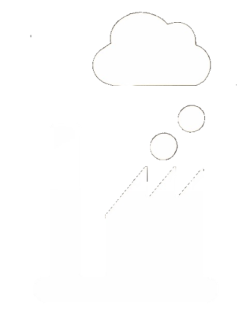

# ia-cloud カスタムNode群

ia-cloud カスタムNodeは以下のレポジトリーで構成され、それぞれのレポジトリーが複数のカスタムNode、およびカスタムNodeで使用されるいくつかの設定Nodeを含む。

### ia-cloud カスタムNode群のレポジトリー構成

* node-red-contrib-ia-cloud-fds  
  ia-cloudのField Data Server(FDS)を構成するNode群のレポジトリー  

* node-red-contrib-ia-cloud-fds-raspberryPi  
  ia-cloudのField Data Server(FDS)を構成するNodeで、Raspberry PiをH/WプラットフォームとするNode群のレポジトリー  

* node-red-contrib-ia-cloud-dashboard  
  Node-RED標準のダッシュボードNode群と共に、ia-cloudのデータ分析や見える化のためのダッシュボードを構成する、Node群のレポジトリー

* node-red-contrib-ia-cloud-common-node  
  ia-cloudの各レポジトリーのnodeから利用される、共通のNode群（設定Node）のレポジトリー  

---

## ia-cloud カスタムNode群のカテゴリー

ia-cloud関連のNodeは以下のいずれかのカテゴリーに属し、Node-REDエディタのパレット上のカテゴリーに分類表示される。

* ia-cloud devices  
  通信やI/Oポートの接続された、センサや計測機器・制御機器のデーやを取得・書き出しするNode群のカテゴリー。原則としてこれらのNodeは、出力メッセージとして、ia-cloudオブジェクトやia-cloudオブジェクトで定義されているcontentDataを出力する。  

* ia-cloud services  
  ia-cloud Center sever(CCS)に接続し、接続の管理を行い、他のNodeからのia-cloudオブジェクトの格納や、取り出し等を行うNode群  

* ia-cloud functions  
  ia-cloud Device Nodeと、ia-cloud service Nodeの間で、様々なデータ変換や評価分割抽出などを行う機能Node群  

* ia-cloud DB access  
  ia-cloud CCS等からデータを取得し、グラフや分析Nodeに供給する機能のNode群  

* ia-cloud visuals  
  ia-cloudの様々なデータ（FDS内で取得したデータや、ia-cloudを初めとするクラウドから取得したデータ）をグラフ等で可視化・分析するNode群  

---

## ia-cloudカスタムNodeの作成作法

ia-cloudカスタムNodeは、Node-RED公式ドキュメントの「Nodeの開発」に従うと同時に、  
以下の項目の作法に従うことを原則とする。  

### NodeのパレットラベルとNodeラベル

ia-cloudカスタムNodeは、パレットラベルをそのNodeの定義htmlファイル内で、以下のように定義し、localeのメッセージカタログ .json ファイルに、"palletLabel"のエントリーを入れること。

```js
    paletteLabel: function() {
        return this._('editor.palletLabel') || '{Localeのメッセージカタログがなかった場合の表示文字列}'
    },
```

同時に、デフォルトのノード名称には、'' (空文字列)を設定し、Nodeラベルは、以下のように定義のこと。

```js
    label: function () {
        return this.name || this._('editor.palletLabel');
    },
    labelStyle: function () {
        return this.name ? 'node_label_italic' : '';
    },
```

これで、Nodeを新たにワークスペースにドラッグ＆ドロップした時、ノード名称が、'' (空文字列)の時には、パレットラベルが、Nodeラベルとして使用される。Node名称がNodeプロパティとして設定された場合は、Node名称がNodeラベルとして使用され、*イタリック斜体*で表示される。

### Node名称プロパティの表示位置

ia-cloudカスタムNode のNode名称プロパティは、Node-RED core のNode群にならってプロパティ編集画面の最下部に置くことを原則とする。

### ia-cloudアイコン

ia-cloudカスタムNodeは、その入力メッセージ、出力メッセージとして、ia-cloudオブジェクトやia-cloud contentDataを入出力する場合、Nodeアイコンにia-cloudアイコンを使用する。

  

### TABの利用

ia-cloudカスタムNodeのエディタ画面において、TABの利用が必要な場合は、Node-RED coreで利用される以下のREDライブラリーを使用すること。なお、このライブラリーは、まだNode-RED公式サイトでのドキュメント化はされていない。
レポジトリ内の既存のNodeのコードを参考に記述のこと。

```js
    // TAB
    const tabs = RED.tabs.create({
        id: '{TAB全体につけられた<div>のid}',
        onchange(tab) {
        $('#{個々のTABをまとめて全体につけられた<div>のid}').children().hide();
        $('#' + tab.id).show();
        },
    });
    tabs.addTab({
        id: '{個々のTABにつけられた<div>のid}',
        label: this._('{個々のTABに表示されるTAB名称}'),    // localeのメセージカタログでlocale表示
    });
    tabs.addTab({
        id: '{個々のTABにつけられた<div>のid}',
        label: this._('{個々のTABに表示されるTAB名称}'),    // localeのメセージカタログでlocale表示
    });
```

### EditableListの利用

ia-cloudカスタムNodeのエディタ画面において、追加削除、順番の入れ替えなど、動的な編集が必要となるプロパティリストを必要とするケースでは、Node-RED公式ドキュメントにある[EditableListウィジェットのAPIレファレンス](https://nodered.jp/docs/api/ui/editableList/)を参照すること。
なお、エディター画面のサイズが変更された場合にサイズ調整のため呼び出すheight()メソッド（おそらくWidth()メソッドも）は、edittableListが隠れたTABなどで非表示の場合は正しく動作しないので、editableListが表示状態の場合のみ実行すること。

### ia-cloudオブジェクトの出力メッセージ

ia-cloudオブジェクトを出力メッセージとして出力する場合は、以下のメッセージ構造を原則とする。

```js
    msg = {
        request: 'store',                // ia-cloudリクエストメッセージ
        dataObject: iaCloudObject,
        payload: iaCloudObject.objectContent.contentData,
    };
```

何らかのエラー等により、正しいiaCloudObjectが出力できない場合でエラーメッセージを送出する場合は、msg.payloadに出力すること。
また、ia-cloudオブジェクトから必要なデータ等を取り出し、ia-cloudオブジェクト以外の出力を送出する場合は、msg.payloadに出力することを原則とする。

### ia-cloud Nodeの入力メッセージ

ia-cloudカスタムNodeの中で、入力メッセージを流処理して出力メッセージを生成し送出するのではなく、通信や周辺機器からのデータからメッセージを送出するものがある。これらのNodeの入力メッセージ仕様は以下のいずれかとする。
* 入力ポートを表示しない。  
mynode.html内のregisterTypeのinputsプロパティに０を設定すする。  

```
inputs: 0,
```
* メッセージ出力のトリガーとする

msg.payloadを評価し真の場合、出力メッセージを送出する


### Helpファイル

ia-cloudカスタムNodeは原則として、Node-REDエディタでNodeを選択した際に表示される、日本語と米国英語のhelpファイルを提供しなければならない。このhelpファイルは国際化のlocaleフォルダに格納する。Nodeのhtml定義ファイルのhelp定義セクションは存在しなくとも良い。
ヘルプファイルのテンプレートは以下に従い、概要・プロパティ項目・入力メッセージ・出力メッセージ・詳細説明　の各項目を設けること。

```html
<script type="text/html" data-help-name="GPi-LED">
    <!-- ここにNode機能の概要を、50文字以内で記述-->
    <p>GrovePiのLEDノード</p>

    <h3>プロパティ項目</h3>
    <dl class="message-properties">
        <dt>GrovePiボード設定ノード<span class="property-type">設定ノード</span></dt>
        <dd>GrovePiボードの設定ノード。</dd>
        <dd>この設定ノードは複数あってはならない。全てのGroveーPiセンサノードから同一のGrovePiボードの設定ノードを使用すること。</dd>
        <dt>GrovePi接続コネクタ<span class="property-type">選択</span></dt>
        <dd>LEDを接続したGrovePiボードのコネクタ番号。D2〜７</dd>
    </dl>
    <h3>入力メーッセージ</h3>
        <p>入力されたmsg.payloadを評価し、GrovePiの接続されたLEDを点灯もしくは消灯する。</p>
        <p>payloadの値が、"off"、false、0、"reset"、"stop"のいずれでもない時、LEDを消灯する。</p>
        <p>それ以外の時は、LEDを点灯する。</p>
    <h3>出力メッセージ</h3>
    <dl class="message-properties">
        <dt>payload <span class="property-type">文字列</span></dt>
        <dd>LEDを転倒または消灯したメッセージ文字列と、入力メッセージを出力</dd>
    </dl>

    <h3>詳細説明</h3>
    <p>入力されたメーッセージにしたがい、GrovePiのLEDを点灯または消灯する</p>

</script>
```
