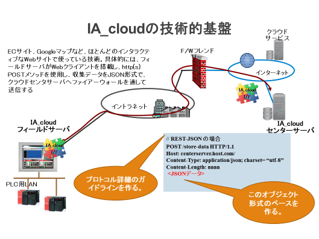

****


# **ia-cloud Specification**
# **Web API Version 2.02β**

*****

July 17<sup>th</sup>, 2018  
Hiro Hashimukai　　@bridge consulting

ia-cloud Project,  
Industrial Automation Forum　  
MSTC Japan
****

# 目的

本仕様書の目的は、産業オートメーション（IA）分野において、オートメーションのフィールドにおける様々な情報を収集蓄積しているIA関連の設備・機器・システムと、これら情報の統合・連携・分析などを行うクラウドサービスとのAPI、つまり情報交換の通信プロトコールと共通的なデータオブジェクトフォーマットに関する仕様を、ia-cloud Web API 仕様として定義することにある。

# 概要

ia-cloudのデータ収集サービスAPIの概要を下図に示す。ia-cloud APIは、IAシステムがファイアーウォール（F/W）の内側から、Webサービスを利用し、Saas型のクラウドサービスであるデータ収集サービスへ接続するためのAPIで、

・REST-fullなHttpsを利用したプロトコールと、WebsocketによるJSONメッセージ交換仕様

・JSON表現の収集データオブジェクトモデル仕様

を規定する。

  

HttpsのPOSTメソッドあるいはWebsocketのメッセージを利用し、JSONで記述されたサービスコマンドとデータオブジェクトを送出する。クラウドサービスからの応答は、Httpsの場合はResponse Bodyに格納されたJSONで、Websocketの場合はWebsocketメッセージのレスポンスとして返される。

## ia-cloudフィールドデータサーバ（FDS）

フィールドデータ収集機能を持ち、センサやコントローラの持つ非構造化データを解釈評価し構造化データに変換し、それを表示したり、一時的な蓄積を行ったりする機器やシステムであり、その構造化データをia-cloud APIにしたがって、クラウドサービスへ送出する機能を、ia-cloudフィールドデータサーバ（FDS）と称する。

具体的には、SCADAソフトウエアや操作表示器、DCSのOIやデータベースシステム、工作機械やロボットのモニタリングソフトウエアーなどを想定している。PLCやセンサを接続したゲートウエイ機器がフィールドデータサーバとしてia-cloud Web APIを実装することも可能である。

一般に、PLCやセンサなどの非構造化データを構造化されたデータオブジェクトに変換するためのマッピングツールを提供することが必要である。

## ia-cloudセンターサーバ（CCS）

ia-cloud Web APIにしたがい、フィールドデータサーバ（FDS）からのデータオブジェクトを受信し、データベースに格納するクラウドサービスの機能をia-cloudセンターサーバ（CCS）と呼ぶ。

> 注:格納するデータベースの形態や構造、データベースに格納したデータオブジェクトのロールアップや統計処理などの付加機能は、本プロジェクトのスコープ外である。
また、データベースに格納したデータオブジェクトをブラウズするWebアプリケーション（Saas）を提供する機能や、ユーザが独自の監視画面などを定義できるエンドユーザコンピューティング環境を提供などが必要となるがこれも、本プロジェクトのスコープではない。

# Webサービスプロトコール

フィールドデータサーバ（FDS）とクラウドセンタサーバ（CCS）との間で使用される通信プロトコールは、HttpsとWssを使用する。

## Https（REST）

ia-cloudのRESTサービスは、全てFDS側からのサービスリクエストから開始される。

FDSは後述するCCSのurlに対し、サービス内容に応じたJSONリクエストボディを付け、Https POSTリクエストを送出する。

### ia-cloudサービスのurl

ia-cloudデータサービスは、以下のurlに対するHttps POSTリクエストによってなされるものとする。CCSはGETなど、他のHttpsリクエストコマンドをサポートしてもよいが、ia-cloud Web APIで使用するのはPOSTのみである。

|リクエストコマンド | url  |
|------------|---------------------------------------------------|
| POST | https://***hostname.domain*** /…/ia-cloud-rest***/v2*** |


|項目                        | 値      | 説明                                     | Notes |
|------------------------------- | -------|------------------------------------------ | -----|
|_**hostname.domain**_ /_**..**_ | string | サービスプロバイダー任意                      |　|
|/ia-cloud-rest/_**v#**_      | string | /ia-cloud-rest/ （固定）とサポートするia-cloud API仕様のバージョン番号<br>本仕様書のバージョンでは：/ia-cloud-rest/v2とする。 |　　|

### 認証とHttps

各FDSは、ia-cloudサービスを提供しているCCSに対し、Https（ポート番号443）で接続するものとする。

CCSはTLS1.2に対応しなければならない。FDS側は、TLS1.2の範囲内でセキュリティレベルと実装のしやすさを考慮した署名や暗号化アルゴリズムを選択できるものとする。ただし、クラウドサービスプロバイダーとしてのセキュリティポリシーを設定し、FDSのSSL/TLS実装レベルを規定することは、各プロバイダーの事業方針にゆだねられる。

また、接続に際してはBasic認証を使用する。FDSは、Basic認証のクライアントを実装しなければならない。下記は、Basic認証を使用したHttpHeaderの例である。（userID =" ia-cloudUserID", Password = "Passcode", base64 encoding）

FDSは認証を維持するために、常にHttp HeaderにBasic認証ヘッダを挿入して構わないが、CCSは認証後のセッションを維持するため、Cookieを使用することができる。したって、FDSは、Cookieを実装する必要がある。Cookieの有効期間(expires)はFDSの実装に依存する。また、CCSは認証のセッション維持以外の目的にCookieを利用しても構わない。

CookieをセットされたFDSは認証後のすべてのHttpRequestHeaderにCookieを挿入する。

FDSは、CCSからレスポンスコード401 (unauthorized) が返された時は、再度、RequestHeaderにIDとパスワードを入れたAuthorizationHeaderを挿入し、認証を試みる。

### プロキシサーバの利用

FDSは、プロキシサーバ経由のアクセスに対応できること。

  - 手動による固定プロキシサーバを指定する方法

  - PACスクリプトファイルの指定による方法

  - WPADによる自動設定

のいずれか一つは、実装しなければならない。

### Http(s)エラー処理

エラー処理は、httpの仕様RFC7231に基づく。

本仕様書で定義するJSONの構造や内容に関するエラーが発生した場合は、CCSはレスポンスヘッダーのステータスコードに400 Bad Requestを挿入する。また、4．IAクラウドオブジェクト及び5. IAクラウドデータモデルに定義する後述のiaCloudErrorStatusを格納したiaCloudObjectを生成しDBに格納すること。  
このオブジェクトは、DBのコンソール機能や標準的なAPIで読み出せるほか、後述のretrieveサービスコマンドでFDSが読み出すことができる。  
5．IAクラウドデータモデルに定義する後述のiaCloudErrorStatusに格納するプロパティErrorCode、ErrorDescriptionは以下の定義にしたがうこと。

| ErrorCode | ErrorDescription    | エラーの内容        |
| --------- | ------------------- | ------------- |
| 840       | API command error   | APIコマンドエラー    |
| 841       | Invalid ServiceID   | 無効なServiceID  |
| 842       | object format error | JSONフォーマットエラー |
| 850       | CCS Error           | CCS側での何らかのエラー |

## Webscket

ia-cloudのWebsocketによるサービスは、全てFDS側からのHttpsリクエストによる、Wesocketへのアップグレード要求から開始される。

プロトコール規約はRFC6455に準ずるものとする。(http://tools.ietf.org/html/rfc6455)  
アップグレードに際しての認証と暗号化に関する方針は以下に示す。

  - アップグレードを要求するHttpsリクエスト自体Basic認証を必要とする
  - アップグレードするプロトコールはTLSを使用し、転送データを暗号化する（wssを使用する）。

アップグレード後は、サービス内容に応じたJSON文字列をwssのペイロードとして送受信する。  
Websocketの設定として、次の制限を設けることを推奨する。

  - Web-Socket接続のアイドル・タイムアウト時間
  - CCSが受信できるメッセージの最大サイズ
  - CCSに接続する最大コネクション数

### Web-Socket コネクションの確立

Websocketへのアップグレード要求は、以下のurlに対するHttps POSTリクエストによってなされるものとする。

|リクエストコマンド | url  |
|------------|---------------------------------------------------|
| POST | https://***hostname.domain*** /…/ia-cloud-ws***/v\#*** |


|Property                        | 値      | 説明                                     | Notes |
|------------------------------- | -------|------------------------------------------ | -----|
|_**hostname.domain**_ /_**..**_ | string | サービスプロバイダー任意                      | |
|/ia-cloud-rest/_**v#**_      | string | /ia-cloud-rest/ （固定）とサポートするia-cloud API仕様のバージョン番号<br>本仕様書のバージョンでは：/ia-cloud-rest/v2とする。 | 　|


コネクション確立のために、FDSからHTTP GETによるハンドシェイク・リクエストをCCSに送信する。CCSはハンドシェイク・リクエストが有効な場合、ハンドシェイク・レスポンスをFDSに送信し、コネクション確立とする。

以下に、ハンドシェイクのサンプルを記載する。(SSL/TLSは事前に確立済みとする)

  - ハンドシェイク・リクエスト (FDS → CCS)
```
GET /iaCloudWss/rev2.0 HTTP/1.1
Host: hostname.domain
Upgrade: websocket
Connection: Upgrade
Sec-WebSocket-Key: dGhlIHNhbXBsZSBub25jZQ== Origin: http://example.com
Sec-WebSocket-Protocol: chat, superchat Sec-WebSocket-Version: 13
```

  - ハンドシェイク・レスポンス (CCS → FDS)
```
HTTP/1.1 101 Switching Protocols
Upgrade: websocket
Connection: Upgrade
Sec-WebSocket-Accept: s3pPLMBiTxaQ9kYGzzhZRbK+xOo=
```


プロキシサーバの使用やエラー処理など、アップグレード前のHttps関連の仕様・振舞に関しては、3.1 REST（Https）の章に準ずるものとする。

# サービスのリクエスト

## 概要

ia-cloud Web APIにおけるサービスのリクエストは、

REST API：httpsのPOSTリクエストボディ  
Websocket API：wssのペイロード

に格納したJSON文字列で記述されたオブジェクトで記述される。JSONリクエストボディによるサービスリクエストの種類は

| No | サービス               | サービスコマンド  | REST | WSS上り | WSS下り    |
| -- | ------------------ | --------- | ---- | ----- | -------- |
| 1  | 接続の開始           | connect   | 〇    | 〇     |          |
| 2  | 接続の確認・再設定    | getstatus | 〇    | 〇     |          |
| 3  | データオブジェクトインスタンスの格納 | store     | 〇    | 〇     | △（実装は任意） |
| 4  | データオブジェクトインスタンスの取得 | retrieve  | 〇    | 〇     | 〇        |
| 5  | 接続の終了              | terminate | 〇    | 〇     |          |
| 6  | 各種工業系通信プロトコールの搬送   | convey    |      | 〇     | 〇        |

が規定されている。

## 接続の開始

FDSは、CCSへの接続に際し必要なuserIDとFDSKeyを付与されていなければならない。userID、FDSkeyを付与する方法などについてはia-cloudでは規定しない。各サービスプロバイダーが仕様を自由に決定してよい。

FDSは、各種のサービスの利用に先立って、CCSとの接続を確立する必要がある。レスポンスボディで戻されたserviceIDを使って、その後のサービスを利用する。

Request json
```
{
    // User 情報、FDS 情報
    "request" : "connect",
    "Authorization" : { string } ,
    "FDSKey" : { string } ,
    "FDSType" : "iaCloudFDS",
    "timestamp" : { string },
    "comment" : { string }
}
```


| Property  |値     | 説明                        | Notes |
|-----------|-------|-----------------------------|-------|
| request | string  | "connect"                  | 固定  |
| Authorization |string  | サービスプロバイダーから支給されたCCSへアクセスするためのユーザのIDとパスワードをHttpのBasic認証に倣って設定する。<br> "Basic SUFfY2xvdWRVc2VySUQ6UGFzc2NvZGU=" <br>（userID = "ia-cloudUserID", Password = "Passcode", base64 encoding） | hhttpsの場合省略可  
| FDSKey | string | このFDSのユニークなKey |       |
| FDSType| string | "iaCloudFDS"    | 固定  |
| timestamp  | string    | サービスへ接続する時点でのタイムスタンプ<br>ISO8601に規定される[拡張表記]文字列。<br> 例：2014-08-15T13:43:28.123456+9:00| |
|comment  | string  | FDSと接続に関する任意の説明。取り扱いは、CCS側に依存する。 | 省略可 |

Response json
```
{
    "userID" : { string } ,
    "FDSKey" : { string } ,
    "FDSType" : "iaCloudFDS",
    "serviceID" : { string }
}

```

| Property | 値     | 説明  | Notes |
|----------|-------|------|-------|
| userID  | string | サービスプロバイダーから支給されたサービスを受けるユーザのID<br>接続Requestのコピー  | |
| FDSKey  | string | このFDSのユニークなKey  接続Requestのコピー  | |
| FDSType | string | iaCloudFDS   | 固定  |
| serviceID | string | FDSがCCSにデータを格納するため等に使用するサービスID。<br> userID, FDSKey, timestampなどから生成されたHash値等を使用する。| 　 |


## データオブジェクトインスタンスの格納

FDSがデータの格納サービスを利用する際のリクエスト。

CCSは、受け取ったオブジェクトを、ObjectKeyとtimestampをキーにデータベース（DB）へ格納する。DBは、Key Value Store（KVS）などのNoSQL DBを想定しているが、実装はCCSサービスプロバイダーに依存する。

本仕様では、"dataObject"がiaCloudObjectArryの場合、CCSはArryを、各iaCloudObject要素に分解し、それぞれのiaCloudObjectをDBに格納することを想定している。しかし、実際にどう実装するかについては、各CCSサービスプロバイダーに依存する。

Request json
```
{
    "request" : "store"
    "serviceID" : { string } ,
    "dataObject" : { iaCloudObject }    //  4.  IA_cloudオブジェクトで詳細記述
}
```


| Property   | 値      | 説明                                           | Notes |
| ---------- | ------ | -------------------------------------------- | ----- |
| request    | string | "store"                                      | 固定    |
| serviceID  | string | 接続時あるいは直前のResponse Bodyで返された serviceID       |       |
| dataObject | object | CCSに格納すべきiaCloudObjectモデル、もしくはその拡張モデルのインスタンス |　|

Response json
```
{
    "FDSKey" : { string } ,
    "ServiceID" : { string },
    "newServiceID" : { string },
    "optionalMessage" : {object}
}
```
| Property        | 値     | 説明         | Notes |
|-----------------|--------|-------------|-------|
| serviceID     | string | データ格納Requestで使用されたserviceID 格納Requestのコピー   |         |
| status     | string | 格納Requestの実行結果  {"ok" / "ng"}  |　|
| newServiceID   | string | 次回の格納Requestで使用されるべきserviceID。 変更の必要がなければ、同一のserviceIDが返される。  |       |
| optionalMessage  | object | FDSへ送付する任意のJSONオブジェクトメッセージ。FDSは解釈できないoptionnalMessageを読み飛ばさなければならない。 | 省略可|

## データオブジェクトインスタンスの取得

FDSがCCSからデータを取得するサービスを利用する際のリクエスト。
CCSは、該当するObjecyKeyとtimestampをキーにDBを検索し、該当するiaCloudObjectをレスポンスとしてJSONで返す。
timestamp instanceKeyいずれも""の場合、CCSは保持する最新のインスタンスを返す。  
指定されたtimestampのオブジェクトが存在しない場合は、そのtimestamp以前の最も新しいオブジェクトを返す。

Request json
```
{
    "request" : "retrieve",
    "serviceID" : { string } ,
    "retrieveObject : {
        "objectKey" : { string } ,
        "timestamp" : { string },
        "instanceKey" : { string }
    }
}

```

| Property  | 値    | 説明   | Notes |
|-----------|-------|-------|-------|
| request  | string | "retrieve"   | 固定  |
| serviceID  | string | 接続時あるいは直前のResponse Bodyで返された serviceID    |       |
| objectKey  | string | 取得するia-cloudオブジェクトのKey       |       |
| timestamp  | string | 取得するia-cloudオブジェクトインスタンスのタイムスタンプ。 ISO8601に規定される文字列。<br> 例：2014-08-15T13:43:28.123456+9:00 <br> timestamp instanceKeyいずれも""の場合、CCSは保持する最新のインスタンスを返す。<br> 指定されたtimestampのオブジェクトが存在しない場合は、そのtimestamp以前の最も新しいオブジェクトを返す。 |        |
| instanceKey  | string | 取得するia-cloudオブジェクトインスタンスのユニークID。<br>objectKey + timestamp and/or instanceKey をもって、個々のインスタンスのユニークキーとなる。<br>timestamp instanceKeyいずれも""の場合、CCSは保持する最新のインスタンスを返す。 | 省略可|

Response json
```
{
    "serviceID" : { string } ,       // サービスID
    "status" : { string },
    "newServiceID" : { string },
    "dataObject" : { iaCloudObject }    //  4.  IA_cloudオブジェクトで詳細記述
}
```
| Property     | 値     | 説明                 | Notes |
|--------------|--------|---------------------|-------|
| serviceID    | string | データ格納Requestで使用されたserviceID retrieve Requestのコピー |       |
| status      | string | retrieve Requestの実行結果 {"ok"/"ng"}  |  |
| newServiceID | string | 次回の格納Requestで使用されるべきserviceID。変更の必要がなければ、同一のserviceIDが返される。 |       |
| dataObject   | object | 取得されたia-cloudオブジェクト|　   |

## 状態の確認（serviceIDの更新）

FDS側から何らかの理由で、serviceIDの再取得が必要となった場合のサービスリクエスト。  
CCSは、新たなserviceIDを発行することが期待されているが、それまで使用していたserviceIDと異なるserviceIDを発行することが必須ではない。

Request json

```
{
    "request" : "getStatus",
    "serviceID" : { string } ,
    "timestamp" : { string },
    "comment" : { string }
}
```
| Property  | 値     | 説明                                                  | Notes  |
|-----------|--------|-------------------------------------------------------|--------|
| request   | string | "getStatus"                                           | 固定   |
| serviceID | string | 接続時あるいは直前のResponse Bodyで返された serviceID |        |
| timestamp | string | サービスへ接続する時点でのタイムスタンプISO8601に規定される文字列。<br>例：2014-08-15T13:43:28.123456+9:00   |　|
| comment   | string | FDSと接続に関する任意の説明  取り扱いは、CCS側に依存する。                         | 省略可 |

Response json
```
{
    "FDSKey" : { string } ,
    "ServiceID" : { string },
    "newServiceID" : { string },
    "optionalMessage" : {object}
}
```

| Property        | 値     | 説明                                                            | Notes  |
|-----------------|--------|-----------------------------------------------------------------|--------|
| FDSKey          | string | このFDSのユニークなKey。接続Requestのコピー    |        |
| ServiceID       | string | 接続時あるいは直前のResponse Bodyで返された serviceID。リクエストボディにあったもののコピー。   ||
| newServiceID    | string | 次回の格納Requestで使用されるべきserviceID。 変更の必要がなければ、同一のserviceIDが返される。   |        |
| optionalMessage | object | FDSへ送付する任意のJSONオブジェクトメッセージ。  FDSは解釈できないoptionnalMessageを読み飛ばさなければならない。  | 省略可 |

## 接続の終了

FDS側から接続を終了するサービスリクエスト。CCSは以降、関連付けられているserviceIDによるサービスは受け付けない。（Invalid serviceID エラー）

Request json

| Property  | 値      | 説明                              | Notes |
| --------- | ------ | -------------------------------------- | ----- |
| request   | string | "terminate"                            | 固定    |
| serviceID | string | 接続時あるいは直前のResponse Bodyで返された serviceID |　|


Response json

| Property        | 値              | 説明            | Notes           |
|--------|--------|--------|--------|
| userID          | string          | サービスプロバイダーから支給されたサービスを受けるユーザのID。<br>接続Requestのコピー |             |
| FDSKey   | string   | このFDSのユニークなKey。接続Requestのコピー |     |
| ServiceID | string  | 接続時あるいは直前のResponseBodyで返されたserviceID。<br>リクエストボディにあったもののコピー。 |  |
| message  | string   | "disconnected"  | 固定 |


## 他の通信プロトコールの搬送convey

ia-cloud Web APIを利用して、他の工業系通信プロトコールのメッセージを伝送するサービス。

dataObjectには、6.18通信電文搬送モデルに示すオブジェクトを格納する。

Request json

| Property        | 値              | 説明            | Notes           |
|--------|--------|--------|--------|
| request    | string| "convey"      | 固定            |
| serviceID  | string| 接続時あるいは直前のResponse  Bodyで返されたserviceID       |      |
| detaObject | object| conveyサービスによって搬送されるデータのオブジェクト<br>6.17通信電文搬送モデルのd ataContentを格納したiaCloudObject   |  　   |


Response json

| Property        | 値              | 説明            | Notes           |
|--------|--------|--------|--------|
| serviceID       | string          | データ格納Requestで使用されたserviceID格納Requestのコピー |             |
| status          | string          | 格納Requestの実行結果***{"ok"/"ng"}***            | |
| newServiceID    | string          | 次回の格納Requestで使用されるべきserviceID。変更の必要がなければ、同一のserviceIDが返される。 |            |
| dataObject      | object          | conveyサービスによって搬送されるデータのオブジェクト6.17通信電文搬送モデルのdataContentを格納したiaCloudObject   | 　  |


# ia-cloudオブジェクト

FDSとCCSと間でやり取りされるia-cloudオブジェクトモデルを以下に定義する。

ia-cloudオブジェクトモデルは、基本モデルと、基本モデルの配列を持つオブジェクトアレイモデルの2種類がある。

## オブジェクトモデル

ia-cloudオブジェクトは、一つのia-cloud ObjectContentを保持するオブジェクトモデルである。

```
// ******************************************************
// ia-cloud/JSON object Model
// ******************************************************

var iaCloudObject = {

    // metaData
    "objectType" : "iaCloudObject",
    "objectKey" : { string } ,
    "objectDescription" : { string },
    "timestamp" : { string },
    "instanceKey" : { string },

    // objectContent
    "objectContent"  : { iaCloudObjectContent }

}

```

#### 各プロパティの意味と制限 ####


| Property        | 値              | 説明            | Notes           |
|--------|--------|--------|--------|
| objectType      | string   | 基本モデルは、"iaCloudObject"       | 固定            |
| objectKey       | string   | このオブジェクトのKey<br>userID内の名前空間でユニークでなければならない。サービスプロバイダーとユーザとの取り決めに依存する。<br>uri表記を使用することを推奨する。<br>例：<br>com.mydomain.ia-cloud.site.equipment.objectName<br>com.mydomain.ia-cloud.sitename.fdsname.objectname<br>省略された場合親オブジェクトの"objectKey"を引き継ぐ。 | ルートオブジェクト以外は省略可 |
| objectDescription | string   | データオブジェクトの説明・名称など| 省略可 |
| timestamp       | string  | このオブジェクトインスタンスのタイムスタンプ。ISO8601に規定される文字列。<br>例：2014-08-15T13:43:28.123456+9:00  秒以下については省略可。<br>省略された場合親オブジェクトの"timestamp"を引き継ぐ。        | ルートオブジェクト以外は省略可 |
| instanceKey     | string | このオブジェクトインスタンスのユニークID。<br>製造工番やシリアル番号などを想定している。タイムスタンプとの併用も可   (objectKey + timestamp) and/or instanceKey をもって、個々のインスタンスのユニークキーとなる。 | 省略可 |
| objectContent   | object | 任意のiaCloudObjectContent <br>5.IAクラウドデータモデル参照 | 　 |


## オブジェクトアレイモデル

```
// ******************************************************
// ia-cloud/JSON object Array Model
// ******************************************************

var iaCloudObjectArray = {

    "objectType" : "iaCloudObjectArray",
    "objectKey" : { string } ,
    "objectDescription" : { string },
    "timestamp" : { string },
    "instanceKey" : { string },
    "length" : { number},

    // Array of contentDataArray

    "objectArray" : [
        { iaCloudObject } ,

    /*      .
        one or more any ia-cloud object
            .
            .            */
    ]
}


```

iaCloudObjectの配列オブジェクト。格納されるiaCloudObjectのtimestampやobjectKeyなどに制約はないが、異なるtimestampの同一objecyKeyのオブジェクトを格納すればヒストリアンやログデータとなり、同一timestampの複数のiaCloudObjectを格納すれば、同一時点での複数のデータオブジェクトを一度に扱うことができる。

ObjectArray配列には、iaCloudObjectArrayを格納してはならない。

#### 各プロパティの意味と制限 ####


| Property        | 値              | 説明            | Notes           |
|--------|--------|--------|--------|
| objectType      | string          | "iaCloudObjectArray"  | 固定            |
| length          | number          | ログデータの配列の大きさ |        |
| objectArray     | Array of iaCloudObject       | ia-cloudオブジェクトの配列。  | 　 |
 **他のプロパティは、基本モデルと同じ。**


## オブジェクトモデルの簡易表現

ia-cloud Web API仕様で規定しているオブジェクトモデル構造や各プロパティ名称など、標準仕様として名称の重複を避け、検索性や一意性を確保するため、限定された用途においては冗長である場合がある。

アプリケーションが限定されており、データの相互利用性や拡張性が要求されない場合、以下に示すような簡易表現を用いてもよい。ただし、通信やストレージ容量、処理時間などの制約が大きい場合に限る。

iaCloudObjectのプロパティ


| | プロパティ      | 簡易名称        | 説明            |
|--------|--------|--------|--------|
| 1 | objectType      | 基本モデルは省略可 | "iaCloudObject"は省略可<br>"iaCloudObjectArry"の簡易表現は、"array" |
| 2 | objectKey       | key             | 簡易表現が可能<br>userID内の名前空間でユニークであれば、uri表記である必要はない。 |
| 3 | objectDescription | 省略可          | もともと省略可  |
| 4 | timestamp | ts | timestampの値の形式も、アプリケーション依存で決定してもよい。|
| 5 | instanceKey     | iKey            | 簡易表現が可能<br>もともと省略可のケースは省略可能 |
| 6 | objectContent   | cont            | 簡易表現が可能  |

# ia-cloud データモデル

iaCloudオブジェクトに格納されるObjectContentのデータモデルを定義する。

本章で定義するデータモデルは、ユースケースに応じて随時拡張されるものとする。

## 基本データモデル

```
// ******************************************************
// ia-cloud/JSON object Content Model
// ******************************************************

var iaCloudObjectContent = {

    "contentType" = "iaCloudData" ,  
    "contentData" = [
      {
        "dataName" : {string} ,
        "commonName" : {string} ,
        "unit" : {string} ,
        "dataValue" : { primitivedata|nestedobject }  
      } ,

      /*        .
      one or more any contentData
                .
                .                          */
     ]
}

```

ia-cloudで最も基本となるデータモデルである。他のモデルはこれを拡張したものである。

### 各プロパティの意味と制限 ###


| Property名  | 値  | 説明  | Notes|
|--------|--------|--------|--------|
| contentType | string      | "iaCloudData"<br>"contentData"配列に格納されるオブジェクトにより、この"contentType"が異なる。<br>基本モデルは、"com.ia-cloud.contenttype.iaCloudData"を省略し、"iaCloudData"とする。<br>任意に独自拡張したcontentTypeは、フルのuri表記とする。| 固定 |
| contentData | object array       | 以下に示す一つ以上のJSONオブジェクト配列 |　|

#### contentData object ####
| Property名  | 値  | 説明   | Notes|
|--------|--------|--------|--------|
| commonName  | string      | contentDataの共通の名前。<br>contentType毎に定められている場合省略不可。 | 省略可      |
| dataName    | string      | contentData の任意の名前（各Localeに基づいた名前。<br> commmonNameがある場合は省略可 |  省略可 |
| Unit        | string      | dataValueが表す数値の単位。<br>ISO1000、ISO/IEC80000に準拠したMKS単位系を使用することを原則とする。dataValueが時刻を表す場合は"time"を、また、無単位の場合はNull文字列""とすること。|  ""の場合は、省略可 |
| dataValue   | JSON primitive or nested JSON object | contentDataの値。Null以外の任意のprimitiveデータ、あるいは任意のObject。時刻を表す場合は、ISO8601に規定される文字列。<br>例：2014-08-15T13:43:28.123456+9:00 |　 |

## データモデルの簡易表現

ia-cloud Web API仕様で規定しているデータモデル構造や各プロパティ名称など、標準仕様として名称の重複を避け、検索性や一意性を確保するため、限定された用途においては冗長である場合がある。

アプリケーションが限定されており、データの相互利用性や拡張性が要求されない場合、以下に示すような簡易表現を用いてもよい。ただし、通信やストレージ容量、処理時間などの制約が大きい場合に限る。

iaCloudObjectContentのプロパティ

|   | プロパティ    |簡易名称| 説明                                         |
|---|-------------|-------|---------------------------------------------|
| 1 | contentType | 省略可 | ObjectKey等からデータのTypeが決定できる場合は省略可 |
| 2 | contentData | data  | 簡易表現が可能                                  |
| 3 | commonName  | 省略可 | 異なるアプリケーション間でのデータの相互利用などが想定されない場合、省略可 |
| 4 | dataName    | name  | 簡易表現が可能                                  |
| 5 | Unit        | 省略可 | データが無単位でない場合でも、ObjectKey等からデータの単位が決定できる場合は省略可 |
| 6 | dataValue   | value | 簡易表現が可能                                  |

## 生産実績データモデル

```
// ******************************************************
// ia-cloud/JSON Production Result Data Model
// ******************************************************

var iaCloudProductionResult = {

    "contentType" : " ProductionResult ",
    "contentData" : [
    {
      "commonName" : { "string" } ,
      "dataName" : { "string" } ,
      "unit" : { "string" } ,
      "dataValue" : { number }  
    },
    /*        .
        one or more any contentData objects
              .
              .            */
    ]
}

```

監視対象の設備装置・生産ラインなどの、生産実績を保持するオブジェクトモデルである。

ISO22400 part2 (KPIs for manufacturing operations management) 5.5 Logistical elementsで規定される各elementsの定義に準拠する。

各プロパティの意味と制限


| Property    | 値 | 説明    | Notes  |
|--------|--------|--------|--------|
| contentType | string      | "ProductionResult" | 固定        |
| contentData | Array       | 以下に示す要素を持つ、一つ以上のJSONオブジェクト配列<br>（すべてを含む必要はない） |             |

#### contentData object ####
| Property名  | 値 | 説明    | Notes|
|--------|--------|--------|--------|
|commonName  | string      | contentDataの名前"OrderID"：製造指図のIDおよび、以下のISO22400-2の5.5Logistical elementsで規定される各elementsの定義に準じる<br> "PlannedOrder Quantity"<br>"Scrap Quantity"<br>"Planned Scrap Quantity"<br>"Good Quantity"<br>"Rework Quantity"<br>"Produced Quantity"<br>"Raw Materials"<br>"Raw Materials Inventory"<br>"Finished  Goods Inventory"<br>"Consumable Inventory" <br>"Consumed Material"<br>"Integrated Good Quantity"<br>"Production Loss"<br>"Storage and Transportation Loss"<br>"Other Loss"<br>"Equipment Production Capacity"<br><br>のいずれか、一つ以上の組合せを標準とするが、拡張を許す。 |            |
|dataName    | string      | contentDataの任意の名前。（各Localeに基づいた名前） | 省略可      |
|unit        | string      | ""か、dataValueの適切な単位string | 固定      |
|dataValue   | number      | 上記各contentDataの数量を表す数値 | 　 |


## 在庫実績データモデル

```
// ******************************************************
// ia-cloud/JSON Inventory Data Model
// ******************************************************

var iaCloudInventoryData = {

    "contentType" : " InventoryData ",
    "contentData" : [
      {
        "commonName"" : "Operation Type",
        "dataName" : { "string" } ,
        "unit" : "" ,
        "dataValue" : { string}  
      },
      {
        "commonName" : "Operation Quantity",
        "dataName" : { "string" } ,
        "unit" : "" ,
        "dataValue" : { number }  
      },
      {
        "commonName" : "Location Code",
        "dataName" : { "string" } ,
        "unit" : "" ,
        "dataValue" : { string }  
      },
    ]
}

```

製品在庫、部品在庫などを管理するサービスと現場端末などとの情報交換のためのオブジェクトモデルである。

#### 各プロパティの意味と制限 ####

| Property   | 値      | 説明       | Notes  |
|------------|-------|-----------|--------|
| contentType|string             | "InventoryData"       | 固定   |
| contentData|Array              | 以下に示す一つ以上のJSONオブジェクト配列（すべてを含む必要はない） |        |

#### contentData object ####
| Property名  | 値          | 説明        | Notes|
|--------|--------|--------|--------|
| commonName | string             | "Operation Type" 在庫への操作内容を表す名称    |        |
| dataName   | string             | 任意の名前（各Localeに基づいた名前）           | 省略可 |
| dataValue  | string             | "Inbound" / "Outbound" / "Inventory" のいずれか |        |
| commonName | string             | "Operation Quantity" 操作数量のcontentDataの名前     |        |
| dataName   | string             | 任意の名前（各Localeに基づいた名前）    | 省略可 |
| unit       | string             | "" か Operation Quantityの適切な単位     | 省略可 |
| dataValue  | number             | 数量を表す数値    |        |
| commonName | string             | "Location Code" ロケ―ションを表すcontentDataの名前   |        |
| dataName   | string             | 任意の名前（各Localeに基づいた名前） | 省略可 |
| dataValue  | strings            | ロケーションを表す文字列    |        |

## 品質データモデル

```
// ******************************************************
// ia-cloud/JSON Quality Data Model
// ******************************************************

var iaCloudQualityData = {

    "contentType" : " QualityData ",
    "contentData" : [
    {
      "commonName" : { "string" } ,
      "dataName" : { "string" } ,
      "unit" : { "string" } ,
      "dataValue" : { number }  
    },
    /*      .
        one or more any contentData objects
            .
            .            */
    ]
}
```

監視対象の設備装置・生産ラインなどの、品質実績状態を保持するオブジェクトモデルである。

ISO22400 part2 (KPIs for manufacturing operations management) 5.6 5.7 Quality elementsで規定される各elementsの定義に準拠する。

#### 各プロパティの意味と制限 ####


| Property   | 値   | 説明    | Notes |
|--------|--------|--------|--------|
| contentType | string      | "QualityData" | 固定        |
| contentData | Array       | 以下に示す一つ以上のJSONオブジェクト配列（すべてを含む必要はない）  |　 　|

#### contentData object ####
| Property   | 値   | 説明    | Notes       |
|--------|--------|--------|--------|
| commonName  | string      | Quality Elementの名前<br>ISO22400-2の 5.6 5.7 Quality elementsの定義に準じる<br>"Good Part"<br>"Inspected Part"<br>"Upper Specification Limit"<br>"Lower Specification Limit"<br>"Arithmetic Average"<br>"Average of Average Values"<br>"Estimated Deviation"<br>"Standard Deviation"<br>"Variance"<br><br>のいずれかを標準とするが、拡張を許す。 |        |
| dataName    | string      | 任意の名前（各Localeに基づいた名前） | 省略可 |
| unit        | string      | "" か、Quality Elementの適切な単位string  | 省略可 |
| dataValue   | number      | 数量を表す数値 | 　   |


## 装置ステータスモデル

```
// ******************************************************
// ia-cloud/JSON Equipment Status Data Model
// ******************************************************

var iaCloudEquipmntStatus = {

    "contentType" : " EquipmntStatus ",
    "contentData" : [
    {
      "commonName" : "Status",
      "dataName" : { "string" } ,
      "dataValue" : { string }
    },
    {
      "commonName" : "Production Order",
      "dataName" : { "string" } ,
      "dataValue" : { string }
    },
    {
      "commonName" : "Started Time",
      "dataName" : { "string" } ,
      "unit" : "time" ,
      "dataValue" : { string }
    },
    {
      "commonName" : "Power Consumption",
      "dataName" : { "string" } ,
      "unit" : { string }  ,
      "dataValue" : { string }
    }
    ]
}

```

監視対象の設備装置などの、稼働状態を保持するオブジェクトモデルである。

ISO22400 part2 (KPIs for manufacturing operations management) 5.2 Time model for work unitsで規定されるTime elementsの定義に準拠する。

#### 各プロパティの意味と制限 ####


| Property    | 値          | 説明        | Notes       |
|--------|--------|--------|
| contentType | string      | "EquipmntStatus"         |  固定 |
| contentData | Array       | 以下に示す一つ以上のJSONオブジェクト配列<br>（すべてを含む必要はない） |　 |

#### contentData object ####
| Property名  | 値 | 説明        | Notes|
|--------|--------|--------|--------|
| commonName  | string      | "Status"  装置状態を表す名称 | 固定 |
| dataName    | string      | 任意の名前<br>（各Localeに基づいた名前）  | 省略可 |
| dataValue   | string      | ISO22400-2の 5.2Time model for work unitの定義に準じる<br>"Unit Busy"<br>"Unit Processing"<br>"Production"<br>"Unit Setup"<br>"Unit Delay"<br><br>のいずれかを標準とするが、拡張を許す。 | 　|

| Property名  | 値          | 説明        | Notes|
|--------|--------|--------|--------|
| commonName  | string      | "Production Order" 作業指示を表す名称 | 固定 |
| dataName    | string      | 任意の名前（各Localeに基づいた名前）  | 省略可 |
| dataValue   | string      | 作業指示コード |　|

| Property名  | 値          | 説明        | Notes|
|--------|--------|--------|--------|
| commonName  | string      | "Started Time" 作業開始時間を表す名称 | 固定 |
| dataName    | string      | 任意の名前（各Localeに基づいた名前）  | 省略可 |
| unit        | string      | "time"    | 固定        |
| dataValue   | strings     | 作業開始時刻を示す文字列          |　|

| Property名  | 値          | 説明        | Notes|
|--------|--------|--------|--------|
| commonName  | string      | "Power Consumption"  消費電力を表す名称 | 固定 |
| dataName    | string      | 任意の名前（各Localeに基づいた名前）  |  省略可 |
| unit        | string      | "W", "KW"等、電力量の単位      |             |
| dataValue   | number      | 消費電力を示す数値 | 　|


## エラーステイタスモデル （エラー番号を格納）

```
// ******************************************************
// ia-cloud/JSON Equipment Error Status Model
// ******************************************************

var iaCloudErrorStatus = {
    "contentType" : " ErrorStatus ",
    "contentData" : [
    {
      "commonName" : " Error Status",
      "dataName" : { "string" } ,
      "dataValue" : { boolean}
    },
    {
      "commonName" : "Error Code" ,
      "dataName" : { "string" } ,
      "dataValue" : { string }  
    },
    {
      "commonName" : "Error Description" ,
      "dataName" : { "string" } ,
      "dataValue" : { string }  
    }
    ]
}

```

監視対象の設備装置などの、状態を保持するオブジェクトモデルである。

#### 各プロパティの意味と制限 ####


| Property    | 値          | 説明        | Notes       |
|--------|--------|--------|--------|
| contentType | string      | ErrorStatus | 固定        |
| contentData | JSON object | 以下に示す一つ以上のJSONオブジェクト配列（すべてを含む必要はない） |　 |

#### contentData object ####
| Property名  | 値          | 説明        | Notes|
|--------|--------|--------|--------|
| commonName  | string | "Error Status" エラー状態表すデータ名称 | 固定 |
| dataName    | string      | 任意の名前（各Localeに基づ いた名前）  |省略可 |
| dataValue   | boolean     | true false　のいずれか | 　 |

| Property名  | 値          | 説明        | Notes|
|--------|--------|--------|--------|
| commonName  | string      | "Error Code" エラーコードを表すデータ名称  |固定  |
| dataName    | string      | 任意の名前 （各Localeに基づ いた名前）  | 省略可 |
| dataValue   | string      | エラーコードを表す文字列   | 　 |

| Property名  | 値          | 説明        | Notes|
|--------|--------|--------|--------|
| commonName  | string      | "Error Description" エラー内容表すデータ名称 | 固定 |
| dataName    | string      | 任意の名前（各Localeに基づいた名前）  | 省略可      |
| dataValue   | strings     | エラーの内容を表す文字列  | 　 |


## アラーム＆イベントモデル

```
// ******************************************************
// ia-cloud/JSON Equipment Error Status Model
// ******************************************************

var iaCloudAlarm&Event = {
    "contentType" : " Alarm&Event",
    "contentData" : [
      {
        "commonName" : " A&E Status",
        "dataValue" : { string}
      },
      {
        "commonName" : "A&E Code" ,
        "dataValue" : { string }  
      },
      {
        "commonName" : "A&E Description" ,
        "dataValue" : { string }  
      }
    ]
}

```

監視対象の設備装置などの、警報やイベント状態を保持するオブジェクトモデルである。

#### 各プロパティの意味と制限 ####


| Property    | 値    | 説明  | Notes   |
|--------|--------|--------|--------|
| contentType | string      |"ErrorStatus" | 固定        |             |
| contentData | JSON object Array  | 以下に示す一つ以上のJSONオブジェクト配列（すべてを含む必要はない） |  

#### contentData object ####
| Property名  | 値          | 説明        | Notes|
|--------|--------|--------|--------|
|commonName  |string      | "A&EStatus" エラー状態表すデータ名称  |  固定 |
|dataValue   | string      | "set" :当該A&Eが発生<br>"reset"当該A&Eが復帰<br>"on" :当該A&Eが発生中<br>"off" :当該A&Eは発生していない<br>のいずれか  |　|

| Property名  | 値          | 説明        | Notes|
|--------|--------|--------|--------|
|commonName  |string      | "Error Code" エラーコードを表すデータ名称  | 固定|
|dataValue   | string      | エラーコードを表す文字列          |　 |

| Property名  | 値          | 説明        | Notes|
|--------|--------|--------|--------|
|commonName  |string      | "Error Description" エラー内容表すデータ名 称 | 固定 |
|dataValue   | strings     | エラーの内容を表す文字列          |　 |


## 設備運転状態モデル

```
// ******************************************************
// ia-cloud/JSON Machine Status Model
// ******************************************************

var iaCloudMachineStaus = {

    "contentType" : " MachineStaus",
    "contentData" : [
    {
      "dataName" : { string } ,
      "dataValue" : { string }
    },
    /*        .
        one or more any Machine status objects
              .
              .            */
    ]
}

```

監視対象の設備装置などの、警報やイベント状態を保持するオブジェクトモデルである。

#### 各プロパティの意味と制限 ####

| Property    | 値          | 説明        | Notes       |
|--------|--------|--------|--------|
| contentType | string      | "ErrorStatus" | 固定        |
| contentData | JSON object Array | 以下に示す一つ以上のJSONオブジェクト配列（すべてを含む必要はない）        |　|

#### contentData object ####
| Property名  | 値      | 説明  | Notes|
|--------|--------|--------|--------|
| dataName    | string      | 設備の任意の名前（各Localeに基づ いた名前）  |   |
| dataValue   | string      | "start" :設備が運転開始した<br>"stop" :設備が停止した<br>"on" :設備は運転中<br>"off" :設備は停止中<br><br>のいずれかの文字列 | 　 |


## コントロールポイントモデル

```
// ******************************************************
// ia-cloud/JSON Control Point Data Model
// ******************************************************

var iaCloudControlPointData = {

    "contentType" : "ControlPointData",
    "contentData" : [
        {
          "commonName" : "Process Value"
          "dataName" : { "string" } ,
          "unit" : { string }  ,
          "dataValue" : { number }  },
        {
          "commonName" : "Set Value"
          "dataName" : { "string" } ,
          "unit" : { string }  ,
          "dataValue" : { number }  } ,
        {
          "commonName" : "Manipulated Value"
          "dataName" : { "string" } ,
          "unit" : { string }  ,
          "dataValue" : { number }  } ,
        {
          "commonName" : "Low Limit"
          "dataName" : { "string" } ,
          "unit" : { string }  ,
          "dataValue" : { number }  } ,
        {
          "commonName" : "High Limit"
          "dataName" : { "string" } ,
          "unit" : { string }  ,
          "dataValue" : { number }  } ,
        {
          "commonName" : "Low-low Limit"
          "dataName" : { "string" } ,
          "unit" : { string }  ,
          "dataValue" : { number }  } ,
        {
          "commonName" : "High-high Limit"
          "dataName" : { "string" } ,
          "unit" : { string }  ,
          "dataValue" : { number }  } ,
        {
          "commonName" : "Low Limit Event"
          "dataName" : { "string" } ,
          "unit" : { string }  ,
          "dataValue" : { boolean }  } ,
        {
          "commonName" : "High Limit Event"
          "dataName" : { "string" } ,
          "unit" : { string }  ,
          "dataValue" : { boolean }  } ,
        {
          "commonName" : "Low-low Limit Event"
          "dataName" : { "string" } ,
          "unit" : { string }  ,
          "dataValue" : { boolean }  } ,
        {
          "commonName" : "High-high Limit Event"
          "dataName" : { "string" } ,
          "unit" : { string }  ,
          "dataValue" : { boolean }
        }
    ]
}
```


#### 各プロパティの意味と制限 ####

| Property    | 値          | 説明        | Notes       |
|--------|--------|--------|--------|
| contentType | string      | "ControlPoint" | 固定        |
| contentData | Array       | 以下に示す一つ以上のJSONオブジェクト配列 （すべてを含む必要はない） | 　|

#### contentData object ####
| Property名  | 値   | 説明 | Notes|
|--------|--------|--------|--------|
| commonName  | string | 以下のいずれか。<br><br> "ProcessValue" :number , <br>"Set Value" :number ,<br>"Low  Limit" :number ,<br>"High Limit" :number ,<br>"Low Low Limit" :number ,<br>"High High Limit" : number ,<br>"Low Limit Event" :boolean ,<br>"High Limit Event" :boolean,<br>"Low Low Limit Event" :boolean , <br>"High High Limit Event" :boolean  |             |
|dataName    | string      | 任意の名前 （各Localeに基づいた名前） | 省略可  |
|unit        | string      | システム変数の単位 | ""は、省略可 |
|dataValue   | number or boolean|システム変数の値。変数の型はcommonNameの項を参照  |　|


## 温度調節計モデル

標準的な温度調節計のデータモデル。

```
// ******************************************************
// ia-cloud/JSON Temperature Controllers Data Model
// ******************************************************
var iaCloudTempContData = {

    "contentType" : "TempContData",
    "contentData" : [ {
        "commonName" : "Process Value"
        "dataName" : { "string" } ,
        "unit" : { string }
        "dataValue" : { number }  },
      {
        "commonName" : "Setting Value"
        "dataName" : { "string" } ,
        "unit" : { string }
        "dataValue" : { number }  },
      {
        "commonName" : "Run Mode"
        "dataName" : { "string" } ,
        "unit" : "" ,
        "dataValue" : { boolean }  },
      {
        "commonName" : "Auto Mode"
        "dataName" : { "string" } ,
        "unit" : "" ,
        "dataValue" : { boolean }  },
      {
        "commonName" : "Auto Tuning"
        "dataName" : { "string" } ,
        "unit" : "" ,
        "dataValue" : { boolean }  },
      {
        "commonName" : "Proportional Band"
        "dataName" : { "string" } ,
        "unit" : { string }  },
        "dataValue" : { number }
      {
        "commonName" : "Integral Time"
        "dataName" : { "string" } ,
        "unit" : { string }  },
        "dataValue" : { number }
      {
        "commonName" : "Derivative Time"
        "dataName" : { "string" } ,
        "unit" : { string }  },
        "dataValue" : { number }
      {
        "commonName" : "Error Date"
        "dataName" : { "string" } ,
        "unit" : "" ,
        "dataValue" : { string }  },
      {
        "commonName" : "Error Message"
        "dataName" : { "string" } ,
        "unit" : "" ,
        "dataValue" : { string }
      }
    ]
}

```

#### 各プロパティの意味と制限 ####


| Property    | 値          | 説明        | Notes       |
|--------|--------|--------|--------|
| contentType | string      | "TempContData" | 固定        |
| contentData | Array       | 以下に示す一つ以上のJSONオブジェクト配列（すべてを含む必要はない） | 　|

#### contentData object ####
| Property名  | 値   | 説明 | Notes|
|--------|--------|--------|--------|
| commonName  | string      | 標準的な温度調節器の仕様を基に規定したシステム変数名<br><br>"Process Value"：計測値<br>"Setting Value"：設定値<br>"Run Mode"：運転モード<br>"Auto Mode"：自動モード<br>"Auto Tuning"：オートチューニングモード <br>"Proportional Band"：比例帯<br>"IntegralTime"：積分時間<br>"Derivative Time"：微分時間<br>"Error Date"：エラー発生時刻<br>"Error Message"：エラーメッセージ |          |
|dataName    | string      | 任意の名前（各Localeに基づいた名前）  | 省略可  |
|unit        | string      | システム変数の単位 | ""は省略可 |
|dataValue   | string, number<br>or boolean | システム変数の値。 | 　|


## アクチュエーターモデル

標準的なアクチュエーターのデータモデル。

```
// ******************************************************
// ia-cloud/JSON Actuator Data Model
// ******************************************************
var iaCloudActuatorObject = {
// metaData
    "contentType" : "ActuatorData",
    "contentData" : [ {
        "commonName" : "Servo On",
        "dataName" : { "string" } ,
        "unit" : "",
        "dataValue" : { boolean } }
        {
        "commonName" : "Busy Status",
        "dataName" : { "string" } ,
        "unit" : "",
        "dataValue" : { boolean } }
        {
        "commonName" : "Auto Mode",
        "dataName" : { "string" } ,
        "unit" : "",
        "dataValue" : { boolean } }
        {
        "commonName" : "Normal Status",
        "dataName" : { "string" } ,
        "unit" : "",
        "dataValue" : { boolean } }
        {
        "commonName" : "Zero Return",
        "dataName" : { "string" } ,
        "unit" : "",
        "dataValue" : { boolean } }
        {
        "commonName" : "Emergency Stop",
        "dataName" : { "string" } ,
        "unit" : "",
        "dataValue" : { boolean } }
        {
        "commonName" : "Current Position",
        "dataName" : { "string" } ,
        "unit" : { string }
        "dataValue" : { number } }
        {
        "commonName" : "Current Speed",
        "dataName" : { "string" } ,
        "unit" : { string },
        "dataValue" : { number } }
        {
        "commonName" : "Error Code",
        "dataName" : { "string" } ,
        "unit" : { string } ,
        "dataValue" : { number } }
        {
        "commonName" : "Position Objects",
        "dataName" : { "string" } ,
        "dataValue" : [ {
            "commonName" : "Target Position",
            "dataName" : { "string" } ,
            "unit" : { string } ,
            "dataValue" : { number } }
            {
            "commonName" : "Speed" ,
            "dataName" : { "string" } ,
            "unit" : { string } ,
            "dataValue" : { number } }
            {
            "commonName" : "Acceleration" ,
            "dataName" : { "string" } ,
            "unit" : { string } ,
            "dataValue" : { number } }
            {
            "commonName" : "Deceleration" ,
            "dataName" : { "string" } ,
            "unit" : { string } ,
            "dataValue" : { number } }
        ] ,
     } ]
}


```

#### 各プロパティの意味と制限 ####


| Property    | 値          | 説明        | Notes       |
|--------|--------|--------|--------|
| contentType | string      | "ActuatorData" | 固定 |
| contentData | Array       | 以下に示す一つ以上のJSONオブジェクト配列（すべてを含む必要はない） |　|

#### contentData object ####
| Property名  | 値   | 説明 | Notes|
|--------|--------|--------|--------|
|commonName  | string <br>or object | 標準的なアクチュエーターの仕様を基に規定したシステム変数名<br>"Servo On"：サーボON状態<br>"Busy Status"：移動中<br>"Auto Mode"：運転モード <br>"Normal Status"：運転ステータス<br>"Zero Return"：原点復帰完了<br>"Emergency Stop"：非常停止<br>"Current Position"：現在位置<br>"Current Speed"：現在速度<br>"Error Code"：エラーコード<br>"Position Objects"：ポジションデータ（object配列、下表参照）| |
|dataName    | string      | 任意の名前（各Localeに基づいた名前）  |  省略可 |
|unit        | string      | システム変数の単位 | "は省略可    |
|dataValue   | string, number <br>or boolean| システム変数の値。 |　|

#### Position Objects ####

| Property名  | 値   | 説明 | Notes|
|--------|--------|--------|--------|
|commonName  | string      |"Position Objects"：ポジションデータ（配列）<br> "Target Position"：目標位置 <br>"Speed"：速度<br>"Acceleration"：加速度<br>"Deceleration"：減速度 |           |
|dataName    | string      | 任意の名前（各Localeに基づいた名前）  |  省略可 |
|unit        | string      | システム変数の単位 | "は省略可    |
|dataValue   | string, number <br>or boolean | システム変数の値。 |　|

## インバータモデル

標準的なインバータのデータモデル。

```
// ******************************************************
// ia-cloud/JSON Inverter Controllers Data Model
// ******************************************************
var iaCloudInverterData = {

    "contentType" : "InverterData",
    "contentData" : [
        {
        "commonName" : "Output Frequency",
        "dataName" : { "string" } ,
        "unit" : { string } ,
        "dataValue" : { number }  } ,
        {
        "commonName" : "Frequency Reference" ,
        "dataName" : { "string" } ,
        "unit" : { string },
        "dataValue" : { number } } ,
        {
        "commonName" : "Output Current" ,
        "dataName" : { "string" } ,
        "unit" : { string },
        "dataValue" : { number } } ,
        {
        "commonName" : "Accumulated Time" ,
        "dataName" : { "string" } ,
        "unit" : { string },
        "dataValue" : { number } } ,
        {
        "commonName" : "Forward Rotation" ,
        "dataName" : { "string" } ,
        "unit" : "",
        "dataValue" : { boolean } },
        {
        "commonName" : "Reverse Rotation" ,
        "dataName" : { "string" } ,
        "unit" : "",
        "dataValue" : { boolean } },
        {
        "commonName" : "Error Date" ,
        "dataName" : { "string" } ,
        "unit" : "",
        "dataValue" : { string } },
        {
        "commonName" : "Error Message" ,
        "dataName" : { "string" } ,
        "unit" : "",
        "dataValue" : { string } }
    ]
}

```
#### 各プロパティの意味と制限 ####


| Property    | 値     | 説明  | Notes |
|--------|--------|--------|--------|
| contentType | string      | "InverterData" | 固定        |
| contentData | Array       | 以下に示す一つ以上のJSONオブジェクト配列（すべてを含む必要はない） |　 |

#### contentData object ####
| Property名  | 値   | 説明 | Notes|
|--------|--------|--------|--------|
|commonName  | string      | 標準的なアクチュエーターの仕様を基に規定したシステム変数名。<br><br>"OutputFrequency"：出力周波数<br>"Frequency Reference"：周波数指令<br>"Output Current"：出力電流<br>"AccumulatedTime"：累積稼働時間<br>"Forward Rotation"<br>"Reverse Rotation"：逆転中<br>"Error Date"：エラー発生時刻<br>"Error Message"：エラーメッセージ |          |
| dataName    | string      | 任意の名前  | 省略可（各Localeに基づいた名前）  |
| unit        | string      | システム変数の単位 | ""は省略可 |
| dataValue   | string, number <br>or boolean | システム変数の値。 |　 |


## ロボットORiNデータモデル

ORiN協議会の発行する仕様書「ORiN2仕様書」に基づく、ia-cloud都の情報連携のためのCAOプロバイダーから供給されるデータオブジェクトのデータモデル。

```
// ******************************************************
// ia-cloud/JSON ORiN Provider Model
// ******************************************************

var iaCloudORiNProviderObject = {

    "contentType" : "ORiNProvider",
    "contentData" : [
      {
        "commonName" : "@OPERATING_TIME",
        "dataName" : { "string" } ,
        "unit" : "hour",
        "dataValue" : { number }  },
      {
        "commonName" : "@BUSY_STATUS" ,
        "dataName" : { "string" } ,
        "unit" : "" ,
        "dataValue" : { boolean }  } ,
      {
        "commonName" : "@WORK_POSITION" ,
        "dataName" : { "string" } ,
        "unit" : { strings } ,
        "dataValue" : { number | Array }  } ,

      /*      ・
      one or more any ORiN System Veriables.  
              ・
              ・
              ・            */
    ]
}
```

#### 各プロパティの意味と制限 ####


| Property    | 値 | 説明   | Notes  |
|--------|--------|--------|--------|
| contentType | string      | "ORiNProvider"   | 固定|
| contentData | Array       | 以下に示す一つ以上のJSONオブジェクト配列（すべてを含む必要はない）<br>ORiN2の仕様書に規定される、一つあるいは複数の、CAOシステム変数からなるもの。 |　|

#### contentData object ####
| Property名  | 値   | 説明 | Notes|
|--------|--------|--------|--------|
|commonName  | string      | ORiN2で規定される、@から始まるCAOシステム変数の名称。<br>各システム変数については、ORiN2仕様書を参照のこと。 |            |
|dataName    | string      | 任意の名前（各Localeに基づいた名前）  | 省略可 |
|unit        | string      | CAOシステム変数の単位          |             |
|dataValue   | JSON primitive or<br>Array of primitives       |  CAOシステム変数の値 <br>ORiN2仕様書で規定される各システム変数の型は、適切にJSONにバインドされていなければならない。 |　|

## PLC レジスタモデル

```
// ******************************************************
// ia-cloud/JSON PLC Register Model
// ******************************************************

var iaCloudPLCRegister = {

    "contentType" : "PLCRegister",
    "contentData" : [
        {
        "commonName" : "StartAdress" ,
        "dataValue" : { string } }
        {
        "commonName" : "Length" ,
        "dataValue" : { number } }
        {
        "commonName" : "RegisterData" ,
        "dataValue" : [
            { string } , { string } , { string }
        /*          .
            one or more PLCRegisterData string
                    .
                    .
        */
        ]
    ]
}

```
#### 各プロパティの意味と制限 ####


| Property    | 値   | 説明   | Notes  |
|--------|--------|--------|--------|
| contentType | string      | "PLCRegister" | 固定        |
| contentData | Array       | 以下に示すJSONオブジェクト配列 |　|


#### contentData object ####
| Property名  | 値   | 説明 | Notes|
|--------|--------|--------|--------|
| commonName  | string      | "StartAdress" | 固定        |
| dataValue   | stringの配列 | PLC内部レジスター等のベンダー依存のレジスタアドレス文字列<br>例：M0123, D100,Coil150,HR430など |        |
| commonName  | string      | Length      | 固定        |
| dataValue   | number      | レジスターデータ（16Bit）の配列の大きさ |     |
| commonName  | string      | "RegisterData" | 固定        |
| dataValue   | stringの配列 | レジスターデータ文字列のlengh長の配列。<br>c言語の16進表記<br>例：["0x4a6f",  "0xd5c2",・・・ ]   |　|

## ファイルデータモデル

```
// ******************************************************
// ia-cloud/JSON File Data Model
// ******************************************************

var iaCloudFiledata = {

    "contentType" : "Filedata",
    "contentData" : [
        {
        "commonName" : "File Name" ,
        "dataValue" : { string }  },
        {
        "commonName" : "Encoding" ,
        "dataValue" : { number }  },
        {
        "commonName" : "Size" ,
        "dataValue" : { number }  },
        {
        "commonName" : "Encoded Data" ,
        "dataValue" : { string }  }
    ]
}

```

#### 各プロパティの意味と制限 ####


| Property    | 値 | 説明    | Notes |
|--------|--------|--------|--------|
| contentType | string      | PLCRegister | 固定        |
| contentData | Array       | 以下に示すJSONオブジェクト配列 |　|

#### contentData object ####
| Property名  | 値   | 説明 | Notes|
|--------|--------|--------|--------|
|commonName  | string      | "File Name"      |固定|
|dataValue   | string      | URL encodeされたFile名（パスは任意） |      |
|commonName  | string      | "Encoding" | 固定        |
|dataValue   | string      | ファイルデータのエンコードを表す以下の文字列のいずれか <br>"ascii"、"utf-8"、"base64"  |    |
|commonName  | string      | "Size"    | 固定        |
|dataValue   | number      | エンコードされたファイルの大きさ（バイト数） |  |
|commonName  | string      | "Encoded Data"      |固定|
|dataValue   | string      | エンコードされたファイルデータ（最大256KB） |　|


## Blob データ

データ構造を持たないデータモデル。

```
// ******************************************************
// ia-cloud/JSON Blob object Content Model
// ******************************************************

var iaCloudObjectContent = {

    "contentType" :  "iaCloudBlobData" ,  
    "contentData" : [
      {
        "dataName" : {string} ,
        "dataValue" : {string}  
      } ,

        /*      .
                   one or more any contentData
                .
                .                          */
     ]
}

```

#### 各プロパティの意味と制限 ####

| Property    | 値  | 説明  |   Notes |
|--------|--------|--------|--------|
| contentType | string      | "iaCloudBlobData"    |固定|
| contentData | Array       | 以下に示す一つ以上のJSONオブジェクト配列 | 　|

#### contentData object ####
| Property名  | 値   | 説明 | Notes|
|--------|--------|--------|--------|
|commonName  | string      | "Blob Data"      |固定|
|dataName    | string      | 格納されるデータの任意の名前（各Localeに基づいた名前）  |省略可|
|dataValue   | string      | Blob Dataの値。<br>base64エンコードされたデータ列（最大256KB） |　 |


## 通信電文搬送モデル

ia-cloud Websocket APIを利用して、他の通信プロトコールの電文を搬送するためのデータモデル。

PLC各社の独自のシリアル通信プロトコール・TCP通信プロトコールや、Modbus/TCP、OPC-UAなどの搬送を想定している。

```
// ******************************************************
// ia-cloud/JSON Conveyed Message Content Model
// ******************************************************

var iaCloudObjectContent = {

    "contentType" : "iaCloudConveyedMsg" ,  
    "contentData" : [
        {
        "commonName" : "Source" ,
        "dataValue" : { string }  },
        {
        "commonName" : "Destination" ,
        "dataValue" : { string }  },
        {
        "commonName" : "config" ,
        "dataValue" : { object }  },
        {
        "commonName" : "Message" ,
        "dataValue" : { string }  }
     ]
}

```

#### 各プロパティの意味と制限 ####


| Property    | 値    | 説明 | Notes |
|--------|--------|--------|--------|
| contentType | string      | "iaCloudConveyedMsg"  |固定|
| contentData | Array       | 以下に示す一つ以上のJSONオブジェクト配列 |　|

#### contentData object ####
| Property名  | 値   | 説明 | Notes|
|--------|--------|--------|--------|
|commonName  | string  |"Source"| 固定 |
|dataValue   | string  | Message dataの発信元を表す文字列<br>CCS、FDSが解釈可 能な表現で中継可能な対象であること。 | |
|commonName  | string  | "Distination"        | 固定 |
|dataValue   | string  | Message dataの配信先を表す文字列<br>CCS、FDSが解釈可能な表現で中継可能な対象であること。 |  |
|commonName  | string  | "config"| 固定        |
|dataValue   | object  | Message dataの構成を表すオブジェクト<br>オブジェクとの内部構成は自由に拡張できるが、標準的に以下の構成に準拠すること。<br>{"protocol":"Mitsubishi MC", "Version": "3.4", ????? }   |  |
|commonName  | string |"Message"  | 固定        |
|dataValue   | string      | Messageをbase64エンコードした文字列最大 256kB  |　|

## USER Defined Data Model

本仕様書定義されたデータモデルは、自由に拡張して新たなDataTypeを定義して良い。
