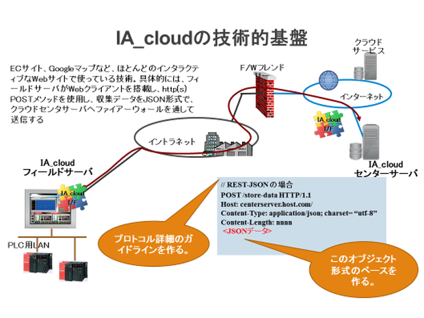

***


# ia-cloud Specification

# Web API Version 2.02β

***

July 17<sup>th</sup> , 2018 <br>
Hiro Hashimukai　　@bridge consulting

ia-cloud Project ,

Industrial Automation Forum　 <br>
MSTC Japan

***

<br><br>

# １．目的

本仕様書の目的は、産業オートメーション（ IA ）分野において、オートメーションのフィールドにおける様々な情報を収集蓄積している IA 関連の設備・機器・システムと、これら情報の統合・連携・分析などを行うクラウドサービスとの API 、つまり情報交換の通信プロトコールと共通的なデータオブジェクトフォーマットに関する仕様を、ia-cloud Web API 仕様として定義することにある。

<br><br>

# ２． 概要

ia-cloud のデータ収集サービス API の概要を下図に示す。ia-cloud API は、IA システムがファイアーウォール（ F/W ）の内側から、Web サービスを利用し、SaaS 型のクラウドサービスであるデータ収集サービスへ接続するための API で、

- REST-full な HTTPS を利用したプロトコールと、Websocket による JSON メッセージ交換仕様

- JSON 表現の収集データオブジェクトモデル仕様

を規定する。



HTTPS の POST メソッドあるいは Websocket のメッセージを利用し、JSON で記述されたサービスコマンドとデータオブジェクトを送出する。クラウドサービスからの応答は、HTTPS の場合は Response Body に格納された JSON で、Websocket の場合は Websocket メッセージのレスポンスとして返される。

<br>

## ２.１　ia-cloud フィールドデータサーバ（ FDS ）

フィールドデータ収集機能を持ち、センサやコントローラの持つ非構造化データを解釈評価し構造化データに変換し、それを表示したり、一時的な蓄積を行ったりする機器やシステムであり、その構造化データを ia-cloud API にしたがって、クラウドサービスへ送出する機能を、ia-cloud フィールドデータサーバ（ FDS ）と称する。

具体的には、SCADA ソフトウエアや操作表示器、DCS の OI やデータベースシステム、工作機械やロボットのモニタリングソフトウェアなどを想定している。PLC やセンサを接続したゲートウェイ機器がフィールドデータサーバとして ia-cloud Web API を実装することも可能である。

一般に、PLC やセンサなどの非構造化データを構造化されたデータオブジェクトに変換するためのマッピングツールを提供することが必要である。

<br>

## ２.２　ia-cloud クラウドセンターサーバ（ CCS ）

ia-cloud Web API に従い、フィールドデータサーバ（ FDS ）からのデータオブジェクトを受信し、データベースに格納するクラウドサービスの機能を ia-cloud クラウドセンターサーバ（ CCS ）と呼ぶ。

> 注 ：　格納するデータベースの形態や構造、データベースに格納したデータオブジェクトのロールアップや統計処理などの付加機能は、本プロジェクトのスコープ外である。また、データベースに格納したデータオブジェクトをブラウズする Web アプリケーション（ SaaS ）を提供する機能や、ユーザが独自の監視画面などを定義できるエンドユーザコンピューティング環境を提供などが必要となるが、これも、本プロジェクトのスコープではない。

<br><br>

# ３．Web サービスプロトコール

フィールドデータサーバ（ FDS ）とクラウドセンターサーバ（ CCS ）との間で使用される通信プロトコールは、HTTPS と WSS を使用する。

<br>

## ３.１　HTTPS（ REST ）

ia-cloud の REST サービスは、全て FDS 側からのサービスリクエストから開始される。

FDS は後述する CCS の url に対し、サービス内容に応じた JSON リクエストボディを付け、HTTPS POST リクエストを送出する。

<br>

### ３.１.１　ia-cloud サービスの url

ia-cloud データサービスは、以下の url に対する HTTPS POST リクエストによってなされるものとする。CCS は GET など、他の HTTPS リクエストコマンドをサポートしてもよいが、ia-cloud Web API で使用するのは POST のみである。

| リクエストコマンド | url                                                                 |
| ------------------ |:-------------------------------------------------------------------:|
|  POST              | https:// ***hostname.domain*** / … / **ia-cloud-rest** / ***v#*** |

| 項 目                           | 値     | 説 明                                     | Notes |
| ------------------------------- | ------ | ----------------------------------------- | ----- |
| ***hostname.domain*** / **...** | string | サービスプロバイダー任意                 |       |
| / ia-cloud-rest / ***v#***      | string | / ia-cloud-rest /（固定）とサポートする ia-cloud API 仕様の <br> バージョン番号。<br><br> 本仕様書のバージョンでは： <br>　**/ ia-cloud-rest / v2** <br> とする。    |       |

<br>

### ３.１.２　認証と HTTPS

各 FDS は、ia-cloud サービスを提供している CCS に対し、HTTPS（ ポート番号 443 ）で接続するものとする。

CCS は TLS1.2 に対応しなければならない。FDS 側は、TLS1.2 の範囲内でセキュリティレベルと実装のしやすさを考慮した署名や暗号化アルゴリズムを選択できるものとする。ただし、クラウドサービスプロバイダーとしてのセキュリティポリシーを設定し、FDS の SSL/TLS 実装レベルを規定することは、各プロバイダーの事業方針にゆだねられる。

また、接続に際しては Basic 認証を使用する。FDS は、Basic 認証のクライアントを実装しなければならない。下記は、Basic 認証を使用した HTTP Header の例である。（ userID = "IA_cloudUserID", Password = "Passcode", base64 encoding ）

FDS は認証を維持するために、常に HTTP Header に Basic 認証ヘッダを挿入して構わないが、CCS は認証後のセッションを維持するため、Cookie を使用することができる。したがって、FDS は、Cookie を実装する必要がある。Cookie の有効期間（ expires ）は FDS の実装に依存する。また、CCS は認証のセッション維持以外の目的に Cookie を利用しても構わない。

Cookie をセットされた FDS は認証後のすべての HttpRequestHeader に Cookie を挿入する。

FDS は、CCS からレスポンスコード 401 ( unauthorized ) が返された時は、再度、RequestHeader に ID とパスワードを入れた AuthorizationHeader を挿入し、認証を試みる。

<br>

### ３.１.３　プロキシサーバの利用

FDS は、プロキシサーバ経由のアクセスに対応できること。

- 手動による固定プロキシサーバを指定する方法

- PAC スクリプトファイルの指定による方法

- WPAD による自動設定

のいずれか一つは、実装しなければならない。

<br>

### ３.１.４　HTTP(S) エラー処理

エラー処理は、HTTP の仕様 RFC7231 に基づく。

本仕様書で定義する JSON の構造や内容に関するエラーが発生した場合は、CCS はレスポンスヘッダーのステータスコードに 400 Bad Request を挿入する。また、５．ia-cloud オブジェクト及び６．ia-cloud データモデルに定義する後述の iaCloudErrorStatus を格納した iaCloudObject を生成し DB に格納すること。<br>
このオブジェクトは、DB のコンソール機能や標準的な API で読み出せるほか、後述の retrieve サービスコマンドで FDS が読み出すことができる。<br>
６．ia-cloud データモデルに定義する後述の iaCloudErrorStatus に格納するプロパティ ErrorCode 、ErrorDescription は以下の定義に従うこと。

| ErrorCode | ErrorDescription    | エラーの内容             |
| --------- | ------------------- | ------------------------ |
| 840       | API command error   | API コマンドエラー       |
| 841       | Invalid ServiceID   | 無効な ServiceID         |
| 842       | object format error | JSON フォーマットエラー  |
| 850       | CCS Error           | CCS 側での何らかのエラー |

<br>

## ３.２　Webscket

ia-cloud の Websocket によるサービスは、全て FDS 側からの HTTPS リクエストによる、Wesocket へのアップグレード要求から開始される。

プロトコール規約は RFC6455 に準ずるものとする。（ <http://tools.ietf.org/html/rfc6455> ）

アップグレードに際しての認証と暗号化に関する方針は以下に示す。

- アップグレードを要求する HTTPS リクエスト自体 Basic 認証を必要とする。
- アップグレードするプロトコールは TLS を使用し、転送データを暗号化する（ WSS を使用する ）。

アップグレード後は、サービス内容に応じた JSON 文字列を WSS のペイロードとして送受信する。<br>
Websocket の設定として、次の制限を設けることを推奨する。

- Web-Socket 接続のアイドル・タイムアウト時間
- CCS が受信できるメッセージの最大サイズ
- CCS に接続する最大コネクション数

<br>

### ３.２.１　Web-Socket コネクションの確立

Websocket へのアップグレード要求は、以下の url に対する HTTPS POST リクエストによってなされるものとする。

| リクエストコマンド | url                                                                |
| ------------------ |:------------------------------------------------------------------:|
| POST               | https:// ***hostname.domain*** / … / **ia-cloud-ws** / ***v#***  |

| 項 目                           | 値     | 説 明                                    | Notes  |
| ------------------------------- | ------ | ---------------------------------------- | ------ |
| ***hostname.domain*** / **...** | string | サービスプロバイダー任意                 |        |
| / ia-cloud-ws / ***v#***        | string | / ia-cloud-ws /（固定）とサポートする ia-cloud API 仕様の <br> バージョン番号。<br><br> 本仕様書のバージョンでは： <br>　**/ ia-cloud-ws / v2** <br> とする。    |       |

コネクション確立のために、FDS から HTTP GET によるハンドシェイク・リクエストを CCS に送信する。CCS はハンドシェイク・リクエストが有効な場合、ハンドシェイク・レスポンスを FDS に送信し、コネクション確立とする。

以下に、ハンドシェイクのサンプルを記載する。（ SSL/TLS は事前に確立済みとする ）

- ハンドシェイク・リクエスト（ FDS → CCS ）

```http
GET /iaCloudWss/rev2.0 HTTP/1.1
Host: hostname.domain
Upgrade: websocket
Connection: Upgrade
Sec-WebSocket-Key: dGhlIHNhbXBsZSBub25jZQ== Origin: http://example.com
Sec-WebSocket-Protocol: chat, superchat Sec-WebSocket-Version: 13
```

- ハンドシェイク・レスポンス（ CCS → FDS ）

```http
HTTP/1.1 101 Switching Protocols
Upgrade: websocket
Connection: Upgrade
Sec-WebSocket-Accept: s3pPLMBiTxaQ9kYGzzhZRbK+xOo=
```

プロキシサーバの使用やエラー処理など、アップグレード前の HTTPS 関連の仕様・振舞に関しては、３.１ HTTPS（ REST ）の章に準ずるものとする。

<br><br>

# ４．サービスのリクエスト

<br>

## ４.１　概要

ia-cloud Web API におけるサービスのリクエストは、

REST API ： HTTPS の POST リクエストボディ <br>
Websocket API ： WSS のペイロード

に格納した JSON 文字列で記述されたオブジェクトで記述される。<br>

JSON リクエストボディによるサービスリクエストの種類は

| No  | サービス                             | サービスコマンド | REST | WSS 上り | WSS 下り           |
|:---:| ------------------------------------ | ---------------- |:----:|:--------:| ------------------ |
| １  | 接続の開始                           | connect          | 〇   | 〇       |                    |
| ２  | 接続の確認・再設定                   | getstatus        | 〇   | 〇       |                    |
| ３  | データオブジェクトインスタンスの格納 | store            | 〇   | 〇       | △（ 実装は任意 ） |
| ４  | データオブジェクトインスタンスの取得 | retrieve         | 〇   | 〇       | 〇                 |
| ５  | 接続の終了                           | terminate        | 〇   | 〇       |                    |
| ６  | 各種工業系通信プロトコールの搬送     | convey           |      | 〇       | 〇                 |

が規定されている。

<br>

## ４.２　接続の開始

FDS は、CCS への接続に際し必要な userID と FDSKey を付与されていなければならない。userID 、FDSkeyを付与する方法などについては ia-cloud では規定しない。各サービスプロバイダーが仕様を自由に決定してよい。

FDS は、各種のサービスの利用に先立って、CCS との接続を確立する必要がある。レスポンスボディで戻された serviceID を使って、その後のサービスを利用する。

**Request json**

```
{
    // User 情報、FDS 情報
    "request"       : "connect",
    "Authorization" : { string },
    "FDSKey"        : { string },
    "FDSType"       : "iaCloudFDS",
    "timestamp"     : { string },
    "comment"       : { string }
}
```

| プロパティ    | 値     | 説 明                                                                                             | Notes                |
| ------------- | ------ | ------------------------------------------------------------------------------------------------- | -------------------- |
| request       | string | "connect"                                                                                         | 固定                 |
| Authorization | string | サービスプロバイダーから支給された CCS へアクセスするためのユーザの ID とパスワードを HTTP の Basic 認証に倣って設定する。<br>　"Basic SUFfY2xvdWRVc2VySUQ6UGFzc2NvZGU="　<br>（ userID = "IA_cloudUserID", Password = "Passcode", base64 encoding ）               | HTTPS の場合、省略可 |
| FDSKey        | string | この FDS のユニークな Key。                                                                       |                      |
| FDSType       | string | "iaCloudFDS"                                                                                      | 固定                 |
| timestamp     | string | サービスへ接続する時点でのタイムスタンプ。<br>　ISO8601 に規定される [拡張表記] 文字列。<br>　例：2014-08-15T13:43:28.123456+09:00                                                                                                                                             |                      |
| comment       | string | FDS と接続に関する任意の説明。　取り扱いは、CCS 側に依存する。                                    | 省略可               |

**Response json**

```
{
    "userID"    : { string },
    "FDSKey"    : { string },
    "FDSType"   : "iaCloudFDS",
    "serviceID" : { string }
}
```

| プロパティ    | 値     | 説 明                                                                                             | Notes                |
| ------------- | ------ | ------------------------------------------------------------------------------------------------- | -------------------- |
| userID        | string | サービスプロバイダーから支給されたサービスを受けるユーザの ID。<br> 接続 Request のコピー。       |                      |
| FDSKey        | string | この FDS のユニークな Key。<br> 接続 Request のコピー。                                           |                      |
| FDSType       | string | "iaCloudFDS"                                                                                      | 固定                 |
| serviceID     | string | FDS が CCS にデータを格納するため等に使用するサービス ID。<br> userID, FDSKey, timestamp などから生成された Hash 値等を使用する。                                                                                                                                              |                      |

<br>

## ４.３　データオブジェクトインスタンスの格納

FDS がデータの格納サービスを利用する際のリクエスト。

CCS は、受け取ったオブジェクトを、objectKey と timestamp をキーにデータベース（ DB ）へ格納する。DB は、Key Value Store（ KVS ）などの NoSQL DB を想定しているが、実装は CCS サービスプロバイダーに依存する。

本仕様では、"dataObject" が iaCloudObjectArray の場合、CCS は Array を、各 iaCloudObject 要素に分解し、それぞれの iaCloudObject を DB に格納することを想定している。しかし、実際にどう実装するかについては、各 CCS サービスプロバイダーに依存する。

**Request json**

```
{
    "request"    : "store",
    "serviceID"  : { string },
    "dataObject" : { iaCloudObject }    //  5．ia-cloudオブジェクトで詳細記述
}
```

| プロパティ      | 値     | 説 明                                                                                                                      | Notes  |
| --------------- | ------ | -------------------------------------------------------------------------------------------------------------------------- | ------ |
| request         | string | "store"                                                                                                                    | 固定   |
| serviceID       | string | 接続時あるいは直前の Response Body で返された serviceID。                                                                  |        |
| dataObject      | object | CCS に格納すべき iaCloudObject モデル、もしくはその拡張モデルのインスタンス。                                              |        |

**Response json**

```
{
	“serviceID” : { string } ,
	“status” : { string },
	“newServiceID” : { string },
	“optionalMessage” : {object}
}

```

| プロパティ      | 値     | 説 明                                                                                                                       | Notes  |
| --------------- | ------ | --------------------------------------------------------------------------------------------------------------------------- | ------ |
| serviceID       | string | データ格納 Request で使用された serviceID。<br> 格納 Request のコピー。                                                     |        |
| status          | string | 格納 Request の実行結果。  { **"ok" / "ng"** }                                                                              |        |
| newServiceID    | string | 次回の格納 Request で使用されるべき serviceID。<br> 変更の必要がなければ、同一の serviceID が返される。                     |        |
| optionalMessage | object | FDS へ送付する任意の JSON オブジェクトメッセージ。<br> FDS は解釈できない optionalMessage を読み飛ばさなければならない。    | 省略可 |

<br>

## ４.４　データオブジェクトインスタンスの取得

FDS が CCS からデータを取得するサービスを利用する際のリクエスト。

CCS は、該当する objecyKey と timestamp をキーに DB を検索し、該当する iaCloudObject をレスポンスとして JSON で返す。
timestamp 、instanceKey いずれも "" の場合、CCS は保持する最新のインスタンスを返す。<br>
指定された timestamp のオブジェクトが存在しない場合は、その timestamp 以前の最も新しいオブジェクトを返す。

**Request json**

```
{
    "request"        : "retrieve",
    "serviceID"      : { string },
    "retrieveObject" : {
        "objectKey"   : { string },
        "timestamp"   : { string },
        "instanceKey" : { string }
    }
}
```

| プロパティ   | 値     | 説 明                                                                                                    | Notes  |
| ------------ | ------ | -------------------------------------------------------------------------------------------------------- | ------ |
| request      | string | "retrieve"                                                                                               | 固定   |
| serviceID    | string | 接続時あるいは直前の Response Body で返された serviceID。                                                |        |
| objectKey    | string | 取得する ia-cloud オブジェクトの Key。                                                                   |        |
| timestamp    | string | 取得する ia-cloud オブジェクトインスタンスのタイムスタンプ。<br>　ISO8601に規定される文字列。<br>　例：2014-08-15T13:43:28.123456+09:00 <br> timestamp 、instanceKey いずれも "" の場合、CCS は保持する最新のインス <br> タンスを返す。指定された timestamp のオブジェクトが存在しない場合は、<br> その timestamp 以前の最も新しいオブジェクトを返す。                                                                       |        |
| instanceKey  | string | 取得する ia-cloud オブジェクトインスタンスのユニーク ID。<br> objectKey + timestamp and/or instanceKey をもって、個々のインスタンス <br> のユニークキーとなる。<br> timestamp 、instanceKey いずれも "" の場合、CCS は保持する最新のインス <br> タンスを返す。      | 省略可 |

**Response json**

```
{
    "serviceID"    : { string },          // サービス ID
    "status"       : { string },
    "newServiceID" : { string },
    "dataObject"   : { iaCloudObject }    //  5．ia-cloud オブジェクトで詳細記述
}
```

| プロパティ   | 値     | 説 明                                                                                                    | Notes  |
| ------------ | ------ | -------------------------------------------------------------------------------------------------------- | ------ |
| serviceID    | string | データ格納 Request で使用された serviceID。<br> retrieve Request のコピー。                              |        |
| status       | string | retrieve Request の実行結果。  { **"ok" / "ng"** }                                                       |        |
| newServiceID | string | 次回の格納 Request で使用されるべき serviceID。<br> 変更の必要がなければ、同一の serviceID が返される。  |        |
| dataObject   | object | 取得された ia-cloud オブジェクト。                                                                       |        |

<br>

## ４.５　状態の確認（ serviceIDの更新 ）

FDS 側から何らかの理由で、serviceID の再取得が必要となった場合のサービスリクエスト。

CCS は、新たな serviceID を発行することが期待されているが、それまで使用していた serviceID と異なる serviceID を発行することが必須ではない。

**Request json**

```
{
    "request"   : "getStatus",
    "serviceID" : { string },
    "timestamp" : { string },
    "comment"   : { string }
}
```

| プロパティ      | 値     | 説 明                                                                                                                    | Notes  |
| --------------- | ------ | ------------------------------------------------------------------------------------------------------------------------ | ------ |
| request         | string | "getStatus"                                                                                                              | 固定   |
| serviceID       | string | 接続時あるいは直前の Response Body で返された serviceID。                                                                |        |
| timestamp       | string | サービスへ接続する時点でのタイムスタンプ。<br>　ISO8601に規定される文字列。<br>　例：2014-08-15T13:43:28.123456+09:00    |        |
| comment         | string | FDS と接続に関する任意の説明。　取り扱いは、CCS 側に依存する。                                                           | 省略可 |

**Response json**

```
{
  	“serviceID” : { string } ,
  	“status” : { string },
  	“newServiceID” : { string },
  	“optionalMessage” : {object}
}
```

| プロパティ      | 値     | 説明                                                                                                                     | Notes  |
| --------------- | ------ | ------------------------------------------------------------------------------------------------------------------------ | ------ |
| FDSKey          | string | この FDS のユニークな Key <br> 接続 Request のコピー。                                                                   |        |
| serviceID       | string | 接続時あるいは直前の Response Body で返された serviceID。<br> リクエストボディにあったもののコピー。                     |        |
| newServiceID    | string | 次回の格納 Request で使用されるべき serviceID。<br> 変更の必要がなければ、同一の serviceID が返される。                  |        |
| optionalMessage | object | FDS へ送付する任意の JSON オブジェクトメッセージ。<br> FDS は解釈できない optionalMessage を読み飛ばさなければならない。 | 省略可 |

<br>

## ４.６　接続の終了

FDS 側から接続を終了するサービスリクエスト。

CCS は以降、関連付けられている serviceID によるサービスは受け付けない。（ Invalid serviceID エラー ）

**Request json**

```
{
    "request"   : "terminate",
    "serviceID" : { string }
}
```

| プロパティ | 値     | 説 明                                                                                                 | Notes  |
| ---------- | ------ | ----------------------------------------------------------------------------------------------------- | ------ |
| request    | string | "terminate"                                                                                           | 固定   |
| serviceID  | string | 接続時あるいは直前の Response Body で返された serviceID。                                             |        |

**Response json**

```
{
    "userID"    : { string },
    "FDSKey"    : { string },
    "serviceID" : { string },
    "message"   : "disconnected"
}
```

| プロパティ | 値     | 説 明                                                                                                 | Notes  |
| ---------- | ------ | ----------------------------------------------------------------------------------------------------- | ------ |
| userID     | string | サービスプロバイダーから支給されたサービスを受けるユーザの ID。<br> 接続 Request のコピー。           |        |
| FDSKey     | string | この FDS のユニークな Key。<br> 接続 Request のコピー。                                               |        |
| serviceID  | string | 接続時あるいは直前の Response Body で返された serviceID。<br> リクエストボディにあったもののコピー。  |        |
| message    | string | "disconnected"                                                                                        | 固定   |

<br>

## ４.７　他の通信プロトコールの搬送 convey

ia-cloud Web API を利用して、他の工業系通信プロトコールのメッセージを伝送するサービス。

dataObject には、6.18 通信電文搬送モデルに示すオブジェクトを格納する。

**Request json**

```
{
    "request"    : "convey",
    "serviceID"  : { string },
    "dataObject" : { object }
}
```

| プロパティ   | 値     | 説 明                                                                                                                        | Notes  |
| ------------ | ------ | ---------------------------------------------------------------------------------------------------------------------------- | ------ |
| request      | string | "convey"                                                                                                                     | 固定   |
| serviceID    | string | 接続時あるいは直前の Response  Body で返された serviceID。                                                                   |        |
| detaObject   | object | convey サービスによって搬送されるデータのオブジェクト。<br> 6.18 通信電文搬送モデルの dataContent を格納した iaCloudObject。 |        |

**Response json**

```
{
    "serviceID"    : { string },
    "status"       : { string },
    "newServiceID" : { string },
    "dataObject"   : { object }
}
```

| プロパティ   | 値     | 説 明                                                                                                                        | Notes  |
| ------------ | ------ | ---------------------------------------------------------------------------------------------------------------------------- | ------ |
| serviceID    | string | データ格納 Request で使用された serviceID。<br> 格納 Request のコピー。                                                      |        |
| status       | string | 格納 Request の実行結果。  { **"ok" / "ng"** }                                                                              |        |
| newServiceID | string | 次回の格納 Request で使用されるべき serviceID。<br> 変更の必要がなければ、同一の serviceID が返される。                      |        |
| dataObject   | object | convey サービスによって搬送されるデータのオブジェクト。<br> 6.18 通信電文搬送モデルの dataContent を格納した iaCloudObject。 |        |

<br><br>

# ５．ia-cloud オブジェクト

FDS と CCS と間でやり取りされる ia-cloud オブジェクトモデルを以下に定義する。

ia-cloud オブジェクトモデルは、基本モデルと、基本モデルの配列を持つオブジェクトアレイモデルの2種類がある。

<br>

## ５.１　オブジェクトモデル

ia-cloud オブジェクトは、一つの ia-cloudObjectContent を保持するオブジェクトモデルである。

```
// ******************************************************
// ia-cloud / JSON object Model
// ******************************************************

var iaCloudObject = {

    // metaData
    "objectType"        : "iaCloudObject",
    "objectKey"         : { string },
    "objectDescription" : { string },
    "timestamp"         : { string },
    "instanceKey"       : { string },

    // objectContent
    "objectContent"     : { iaCloudObjectContent }

}
```

### 各プロパティの意味と制限

| プロパティ        | 値     | 説 明                                                            | Notes                            |
| ----------------- | ------ | ---------------------------------------------------------------- | -------------------------------- |
| objectType        | string | 基本モデルは、"iaCloudObject"                                    | 固定                             |
| objectKey         | string | このオブジェクトの Key。<br> userID 内の名前空間でユニークでなければならない。サービスプロバイダーとユーザとの取り決めに依存する。<br> uri 表記を使用することを推奨する。<br>　例：<br>　　com.mydomain.ia-cloud.site.equipment.objectName <br>　　com.mydomain.ia-cloud.sitename.fdsname.objectname <br> 省略された場合、親オブジェクトの "objectKey" を引き継ぐ。                                                       | ルートオブジェクト以外は省略可   |
| objectDescription | string | データオブジェクトの説明・名称など。                             | 省略可                           |
| timestamp         | string | このオブジェクトインスタンスのタイムスタンプ。<br>　ISO8601 に規定される文字列。<br>　例：2014-08-15T13:43:28.123456+09:00　秒以下については省略可。<br> 省略された場合、親オブジェクトの "timestamp" を引き継ぐ。                            | ルートオブジェクト以外は省略可   |
| instanceKey       | string | このオブジェクトインスタンスのユニーク ID。<br> 製造工番やシリアル番号などを想定している。タイムスタンプとの併用も可  （ objectKey + timestamp ）and/or instanceKey をもって、個々のインスタンスのユニークキーとなる。               | 省略可                           |
| objectContent     | object | 任意の iaCloudObjectContent <br> 6．ia-cloud データモデル参照。  |                                  |

<br>

## ５.２　オブジェクトアレイモデル

```
// ******************************************************
// ia-cloud / JSON object Array Model
// ******************************************************

var iaCloudObjectArray = {

    "objectType"        : "iaCloudObjectArray",
    "objectKey"         : { string },
    "objectDescription" : { string },
    "timestamp"         : { string },
    "instanceKey"       : { string },
    "length"            : { number },

    // Array of contentDataArray

    "objectArray" : [
        { iaCloudObject },

        /*      .
        one or more any ia-cloud object
                .
                .       */

    ]
}
```

iaCloudObject の配列オブジェクト。格納される iaCloudObject の timestamp や objectKey などに制約はないが、異なる timestamp の同一 objecyKey のオブジェクトを格納すればヒストリアンやログデータとなり、同一 timestamp の複数の iaCloudObject を格納すれば、同一時点での複数のデータオブジェクトを一度に扱うことができる。

objectArray 配列には、iaCloudObjectArray を格納してはならない。

### 各プロパティの意味と制限

| プロパティ                                | 値                     | 説 明                      | Notes  |
| ----------------------------------------- | ---------------------- | -------------------------- | ------ |
| objectType                                | string                 | "iaCloudObjectArray"       | 固定   |
| length                                    | number                 | ログデータの配列の大きさ   |        |
| objectArray                               | Array of iaCloudObject | ia-cloudオブジェクトの配列 |        |
| **他のプロパティは、基本モデルと同じ。** |                        |                            |        |

<br>

## ５.３　オブジェクトモデルの簡易表現

ia-cloud Web API 仕様で規定しているオブジェクトモデル構造や各プロパティ名称など、標準仕様として名称の重複を避け、検索性や一意性を確保するため、限定された用途においては冗長である場合がある。

アプリケーションが限定されており、データの相互利用性や拡張性が要求されない場合、以下に示すような簡易表現を用いてもよい。ただし、通信やストレージ容量、処理時間などの制約が大きい場合に限る。

### iaCloudObject のプロパティ

|     | プロパティ        | 簡易名称             | 説 明                                                                                           |
|:---:| ----------------- | -------------------- | ----------------------------------------------------------------------------------------------- |
| １  | objectType        | 基本モデルは省略可   | "iaCloudObject" は省略可。<br> "iaCloudObjectArray" の簡易表現は、"array"。                     |
| ２  | objectKey         | key                  | 簡易表現が可能。<br> userID 内の名前空間でユニークであれば、uri 表記である必要 <br> はない。    |
| ３  | objectDescription | 省略可               | もともと省略可。                                                                                |
| ４  | timestamp         | ts                   | timestamp の値の形式も、アプリケーション依存で決定しても <br> よい。                            |
| ５  | instanceKey       | iKey                 | 簡易表現が可能。<br> もともと省略可のケースは省略可能。                                         |
| ６  | objectContent     | cont                 | 簡易表現が可能。                                                                                |

<br><br>

# ６．ia-cloud データモデル

iaCloud オブジェクトに格納される objectContent のデータモデルを定義する。

本章で定義するデータモデルは、ユースケースに応じて随時拡張されるものとする。

<br>

## ６.１　基本データモデル

```
// ******************************************************
// ia-cloud / JSON object Content Model
// ******************************************************

var iaCloudObjectContent = {

    "contentType" = "iaCloudData",
    "contentData" = [
        {
            "dataName"   : { string },
            "commonName" : { string },
            "unit"       : { string },
            "dataValue"  : { primitivedata | nestedobject }
        },

        /*      .
        one or more any contentData
                .
                .       */

    ]
}
```

ia-cloud で最も基本となるデータモデルである。他のモデルはこれを拡張したものである。

### 各プロパティの意味と制限

| プロパティ  | 値                | 説 明                                                                                                         | Notes  |
| ----------- | ----------------- | ------------------------------------------------------------------------------------------------------------- | ------ |
| contentType | string            | "iaCloudData" <br> "contentData" 配列に格納されるオブジェクトにより、この "contentType" が <br> 異なる。<br> 基本モデルは、"com.ia-cloud.contenttype.iaCloudData" を省略し、"iaCloudData" とする。<br> 任意に独自拡張した contentType は、フルの uri 表記とする。            | 固定   |
| contentData | object <br> array | 以下に示す一つ以上の JSON オブジェクト配列。                                                                  |        |

### contentData object

| プロパティ  | 値                                        | 説 明                                                                                     | Notes                |
| ----------- | ----------------------------------------- | ----------------------------------------------------------------------------------------- | -------------------- |
| commonName  | string                                    | contentData の共通の名前。<br> contentType 毎に定められている場合、省略不可。             | 省略可               |
| dataName    | string                                    | contentData の任意の名前。（ 各 Locale に基づいた名前 ）<br> commmonName がある場合は省略可。  | 省略可               |
| unit        | string                                    | dataValue が表す数値の単位。<br> ISO1000、ISO/IEC80000 に準拠した MKS 単位系を使用することを原則とする。<br> dataValue が時刻を表す場合は "time" を、また、無単位の場合は Null 文字列 "" とすること。                                                              | "" の場合は、省略可 |
| dataValue   | JSON primitive <br> or nested JSON object | contentData の値。<br> Null 以外の任意の primitive データ、あるいは任意の object。<br> 時刻を表す場合は、ISO8601 に規定される文字列。<br>　例：2014-08-15T13:43:28.123456+09:00                                                                                        |                     |

<br>

## ６.２　データモデルの簡易表現

ia-cloud Web API 仕様で規定しているデータモデル構造や各プロパティ名称など、標準仕様として名称の重複を避け、検索性や一意性を確保するため、限定された用途においては冗長である場合がある。

アプリケーションが限定されており、データの相互利用性や拡張性が要求されない場合、以下に示すような簡易表現を用いてもよい。ただし、通信やストレージ容量、処理時間などの制約が大きい場合に限る。

### iaCloudObjectContent のプロパティ

|     | プロパティ  | 簡易名称  | 説 明                                                                                         |
|:---:| ----------- | --------- | --------------------------------------------------------------------------------------------- |
| １  | contentType | 省略可    | objectKey 等からデータの Type が決定できる場合は省略可。                                      |
| ２  | contentData | data      | 簡易表現が可能。                                                                              |
| ３  | commonName  | 省略可    | 異なるアプリケーション間でのデータの相互利用などが想定されない場合、<br> 省略可。             |
| ４  | dataName    | name      | 簡易表現が可能。                                                                              |
| ５  | unit        | 省略可    | データが無単位でない場合でも、objectKey 等からデータの単位が決定でき <br> る場合は、省略可。  |
| ６  | dataValue   | value     | 簡易表現が可能。                                                                              |

<br>

## ６.３　生産実績データモデル

```
// ******************************************************
// ia-cloud / JSON Production Result Data Model
// ******************************************************

var iaCloudProductionResult = {

    "contentType" : "ProductionResult",
    "contentData" : [
        {
            "commonName" : { string },
            "dataName"   : { string },
            "unit"       : { string },
            "dataValue"  : { number }
        },

        /*      .
        one or more any contentData objects
                .
                .       */

    ]
}
```

監視対象の設備装置・生産ラインなどの、生産実績を保持するオブジェクトモデルである。

ISO22400 part2（ KPIs for manufacturing operations management ）　5.5 Logistical elements で規定される各 elements の定義に準拠する。

### 各プロパティの意味と制限

| プロパティ  | 値     | 説 明                                                                                     | Notes  |
| ----------- | ------ | ----------------------------------------------------------------------------------------- | ------ |
| contentType | string | "ProductionResult"                                                                        | 固定   |
| contentData | Array  | 以下に示す要素を持つ、一つ以上の JSON オブジェクト配列。<br>（ すべてを含む必要はない ）  |        |

### contentData object

| プロパティ  | 値     | 説 明                                                                                    | Notes  |
| ----------- | ------ | ---------------------------------------------------------------------------------------- | ------ |
| commonName  | string | contentData の名前 "OrderID" ： 製造指図の ID 及び、以下の ISO22400-2 の <br> 5.5 Logistical elements で規定される各 elements の定義に準じる。<br><br>　"PlannedOrder Quantity" <br>　"Scrap Quantity" <br>　"Planned Scrap Quantity" <br>　"Good Quantity" <br>　"Rework Quantity" <br>　"Produced Quantity" <br>　"Raw Materials" <br>　"Raw Materials Inventory" <br>　"Finished  Goods Inventory" <br>　"Consumable Inventory"  <br>　"Consumed Material" <br>　"Integrated Good Quantity" <br>　"Production Loss" <br>　"Storage and Transportation Loss" <br>　"Other Loss" <br>　"Equipment Production Capacity" <br><br> のいずれか、一つ以上の組合せを標準とするが、拡張を許す。    |        |
| dataName    | string | contentData の任意の名前。（ 各 Locale に基づいた名前 ）                                 | 省略可 |
| unit        | string | "" か、dataValue の適切な単位。                                                          | 固定   |
| dataValue   | number | 上記各 contentData の数量を表す数値。                                                    |        |

<br>

## ６.４　在庫実績データモデル

```
// ******************************************************
// ia-cloud / JSON Inventory Data Model
// ******************************************************

var iaCloudInventoryData = {

    "contentType" : "InventoryData",
    "contentData" : [
        {
            "commonName" : "Operation Type",
            "dataName"   : { string },
            "unit"       : "",
            "dataValue"  : { string }
        },{
            "commonName" : "Operation Quantity",
            "dataName"   : { string },
            "unit"       : "",
            "dataValue"  : { number }
        },{
            "commonName" : "Location Code",
            "dataName"   : { string },
            "unit"       : "",
            "dataValue"  : { string }
        },
    ]
}
```

製品在庫、部品在庫などを管理するサービスと現場端末などとの情報交換のためのオブジェクトモデルである。

### 各プロパティの意味と制限

| プロパティ  | 値      | 説 明                                                                         | Notes  |
| ----------- | ------- | ----------------------------------------------------------------------------- | ------ |
| contentType | string  | "InventoryData"                                                               | 固定   |
| contentData | Array   | 以下に示す一つ以上の JSON オブジェクト配列。<br>（ すべてを含む必要はない ）  |        |

### contentData object

| プロパティ  | 値      | 説 明                                                                         | Notes  |
| ----------- | ------- | ----------------------------------------------------------------------------- | ------ |
| commonName  | string  | "Operation Type"　在庫への操作内容を表す名称。                                |        |
| dataName    | string  | 任意の名前。（ 各 Locale に基づいた名前 ）                                    | 省略可 |
| dataValue   | string  | "Inbound" / "Outbound" / "Inventory"　のいずれか。                            |        |
| commonName  | string  | "Operation Quantity"　操作数量の contentData の名前。                         |        |
| dataName    | string  | 任意の名前。（ 各 Locale に基づいた名前 ）                                    | 省略可 |
| unit        | string  | "" か Operation Quantity の適切な単位。                                       | 省略可 |
| dataValue   | number  | 数量を表す数値。                                                              |        |
| commonName  | string  | "Location Code"　ロケ―ションを表す contentData の名前。                      |        |
| dataName    | string  | 任意の名前。（ 各 Locale に基づいた名前 ）                                    | 省略可 |
| dataValue   | strings | ロケーションを表す文字列。                                                    |        |

<br>

## ６.５　品質データモデル

```
// ******************************************************
// ia-cloud / JSON Quality Data Model
// ******************************************************

var iaCloudQualityData = {

    "contentType" : "QualityData",
    "contentData" : [
        {
            "commonName" : { string },
            "dataName"   : { string },
            "unit"       : { string },
            "dataValue"  : { number }
        },

        /*      .
        one or more any contentData objects
                .
                .        */

    ]
}
```

監視対象の設備装置・生産ラインなどの、品質実績状態を保持するオブジェクトモデルである。

ISO22400 part2（ KPIs for manufacturing operations management ）　5.6 5.7 Quality elements で規定される各 elements の定義に準拠する。

### 各プロパティの意味と制限

| プロパティ  | 値     | 説 明                                                                         | Notes  |
| ----------- | ------ | ----------------------------------------------------------------------------- | ------ |
| contentType | string | "QualityData"                                                                 | 固定   |
| contentData | Array  | 以下に示す一つ以上の JSON オブジェクト配列。<br>（ すべてを含む必要はない ）  |        |

### contentData object

| プロパティ  | 値     | 説 明                                                                         | Notes  |
| ----------- | ------ | ----------------------------------------------------------------------------- | ------ |
| commonName  | string | Quality Element の名前。<br> ISO22400-2 の 5.6 5.7 Quality elements の定義に準じる。<br><br>　"Good Part" <br>　"Inspected Part" <br>　"Upper Specification Limit" <br>　"Lower Specification Limit" <br>　"Arithmetic Average" <br>　"Average of Average Values" <br>　"Estimated Deviation" <br>　"Standard Deviation" <br>　"Variance" <br><br> のいずれかを標準とするが、拡張を許す。                                       |        |
| dataName    | string | 任意の名前。（ 各 Locale に基づいた名前 ）                                    | 省略可 |
| unit        | string | "" か、Quality Element の適切な単位。                                         | 省略可 |
| dataValue   | number | 数量を表す数値。                                                              |        |

<br>

## ６.６　装置ステータスモデル

```
// ******************************************************
// ia-cloud / JSON Equipment Status Data Model
// ******************************************************

var iaCloudEquipmntStatus = {

    "contentType" : "EquipmntStatus",
    "contentData" : [
        {
            "commonName" : "Status",
            "dataName"   : { string },
            "dataValue"  : { string }
        },{
            "commonName" : "Production Order",
            "dataName"   : { string },
            "dataValue"  : { string }
        },{
            "commonName" : "Started Time",
            "dataName"   : { string },
            "unit"       : "time",
            "dataValue"  : { string }
        },{
            "commonName" : "Power Consumption",
            "dataName"   : { string },
            "unit"       : { string },
            "dataValue"  : { number }
        }
    ]
}
```

監視対象の設備装置などの、稼働状態を保持するオブジェクトモデルである。

ISO22400 part2（ KPIs for manufacturing operations management ）　5.2 Time model for work units で規定される Time elements の定義に準拠する。

### 各プロパティの意味と制限

| プロパティ  | 値     | 説 明                                                                         | Notes |
| ----------- | ------ | ----------------------------------------------------------------------------- | ----- |
| contentType | string | "EquipmntStatus"                                                              | 固定  |
| contentData | Array  | 以下に示す一つ以上の JSON オブジェクト配列。<br>（ すべてを含む必要はない ）  |       |

### contentData object

| プロパティ  | 値     | 説 明                                                                         | Notes  |
| ----------- | ------ | ----------------------------------------------------------------------------- | ------ |
| commonName  | string | "Status"　装置状態を表す名称。                                                | 固定   |
| dataName    | string | 任意の名前。（ 各 Locale に基づいた名前 ）                                    | 省略可 |
| dataValue   | string | ISO22400-2 の 5.2 Time model for work unit の定義に準じる。<br><br>　"Unit Busy" <br>　"Unit Processing" <br>　"Production" <br>　"Unit Setup" <br>　"Unit Delay" <br><br> のいずれかを標準とするが、拡張を許す。                                     |        |

| プロパティ  | 値     | 説 明                                                                         | Notes  |
| ----------- | ------ | ----------------------------------------------------------------------------- | ------ |
| commonName  | string | "Production Order"　作業指示を表す名称。                                      | 固定   |
| dataName    | string | 任意の名前。（ 各 Locale に基づいた名前 ）                                    | 省略可 |
| dataValue   | string | 作業指示コード。                                                              |        |

| プロパティ  | 値     | 説 明                                                                         | Notes  |
| ----------- | ------ | ----------------------------------------------------------------------------- | ------ |
| commonName  | string | "Started Time"　作業開始時間を表す名称。                                      | 固定   |
| dataName    | string | 任意の名前。（ 各 Locale に基づいた名前 ）                                    | 省略可 |
| unit        | string | "time"                                                                        | 固定   |
| dataValue   | string | 作業開始時刻を示す文字列。                                                    |        |

| プロパティ  | 値     | 説 明                                                                         | Notes  |
| ----------- | ------ | ----------------------------------------------------------------------------- | ------ |
| commonName  | string | "Power Consumption"　消費電力を表す名称。                                     | 固定   |
| dataName    | string | 任意の名前。（ 各 Locale に基づいた名前 ）                                    | 省略可 |
| unit        | string | "W" 、"KW" 等、電力量の単位。                                                 |        |
| dataValue   | number | 消費電力を示す数値。                                                          |        |

<br>

## ６.７　エラーステイタスモデル（ エラー番号を格納 ）

```
// ******************************************************
// ia-cloud / JSON Error Status Model
// ******************************************************

var iaCloudErrorStatus = {

    "contentType" : "ErrorStatus",
    "contentData" : [
        {
            "commonName" : "Error Status",
            "dataName"   : { string },
            "dataValue"  : { boolean }
        },{
            "commonName" : "Error Code",
            "dataName"   : { string },
            "dataValue"  : { string }
        },{
            "commonName" : "Error Description",
            "dataName"   : { string },
            "dataValue"  : { string }
        }
    ]
}
```

監視対象の設備装置などの、状態を保持するオブジェクトモデルである。

### 各プロパティの意味と制限

| プロパティ  | 値      | 説 明                                                                         | Notes  |
| ----------- | ------- | ----------------------------------------------------------------------------- | ------ |
| contentType | string  | "ErrorStatus"                                                                 | 固定   |
| contentData | Array   | 以下に示す一つ以上の JSON オブジェクト配列。<br>（ すべてを含む必要はない ）  |        |

### contentData object

| プロパティ  | 値      | 説 明                                                                         | Notes  |
| ----------- | ------- | ----------------------------------------------------------------------------- | ------ |
| commonName  | string  | "Error Status"　エラー状態を表すデータ名称。                                  | 固定   |
| dataName    | string  | 任意の名前。（ 各 Locale に基づいた名前 ）                                    | 省略可 |
| dataValue   | boolean | true / false　のいずれか。                                                    |        |

| プロパティ  | 値      | 説 明                                                                         | Notes  |
| ----------- | ------- | ----------------------------------------------------------------------------- | ------ |
| commonName  | string  | "Error Code"　エラーコードを表すデータ名称。                                  | 固定   |
| dataName    | string  | 任意の名前。（ 各 Locale に基づいた名前 ）                                    | 省略可 |
| dataValue   | string  | エラーコードを表す文字列。                                                    |        |

| プロパティ  | 値      | 説 明                                                                         | Notes  |
| ----------- | ------- | ----------------------------------------------------------------------------- | ------ |
| commonName  | string  | "Error Description"　エラー内容を表すデータ名称。                             | 固定   |
| dataName    | string  | 任意の名前。（ 各 Locale に基づいた名前 ）                                    | 省略可 |
| dataValue   | string  | エラーの内容を表す文字列。                                                    |        |

<br>

## ６.８　アラーム＆イベントモデル

```
// ******************************************************
// ia-cloud / JSON Alarm & Event Model
// ******************************************************

var iaCloudAlarm&Event = {

    "contentType" : "Alarm&Event",
    "contentData" : [
        {
            "commonName" : "A&E Status",
            "dataValue"  : { string }
        },{
            "commonName" : "A&E Code",
            "dataValue"  : { string }
        },{
            "commonName" : "A&E Description",
            "dataValue"  : { string }
        }
    ]
}
```

監視対象の設備装置などの、警報やイベント状態を保持するオブジェクトモデルである。

### 各プロパティの意味と制限

| プロパティ  | 値     | 説 明                                                                         | Notes  |
| ----------- | ------ | ----------------------------------------------------------------------------- | ------ |
| contentType | string | "Alarm&Event"                                                                 | 固定   |
| contentData | Array  | 以下に示す一つ以上の JSON オブジェクト配列。<br>（ すべてを含む必要はない ）  |        |

### contentData object

| プロパティ  | 値     | 説 明                                                                         | Notes  |
| ----------- | ------ | ----------------------------------------------------------------------------- | ------ |
| commonName  | string | "A&EStatus"　エラー状態表すデータ名称。                                       | 固定   |
| dataValue   | string | "set" ： 当該 A&E が発生 <br> "reset" ： 当該 A&E が復帰 <br> "on" ： 当該 A&E が発生中 <br> "off" ： 当該 A&E は発生していない  <br><br> のいずれかの文字列。  |        |

| プロパティ  | 値     | 説 明                                                                         | Notes  |
| ----------- | ------ | ----------------------------------------------------------------------------- | ------ |
| commonName  | string | "Error Code"　エラーコードを表すデータ名称。                                  | 固定   |
| dataValue   | string | エラーコードを表す文字列。                                                    |        |

| プロパティ  | 値     | 説 明                                                                         | Notes  |
| ----------- | ------ | ----------------------------------------------------------------------------- | ------ |
| commonName  | string | "Error Description"　エラー内容表すデータ名称。                               | 固定   |
| dataValue   | string | エラーの内容を表す文字列。                                                    |        |

<br>

## ６.９　設備運転状態モデル

```
// ******************************************************
// ia-cloud / JSON Machine Status Model
// ******************************************************

var iaCloudMachineStaus = {

    "contentType" : " MachineStaus",
    "contentData" : [
        {
            "dataName"  : { string },
            "dataValue" : { string }
        },

        /*      .
        one or more any Machine status objects
                .
                .        */

    ]
}
```

監視対象の設備装置などの、運転状態を保持するオブジェクトモデルである。

### 各プロパティの意味と制限

| プロパティ  | 値     | 説 明                                                                         | Notes  |
| ----------- | ------ | ----------------------------------------------------------------------------- | ------ |
| contentType | string | "MachineStatus"                                                               | 固定   |
| contentData | Array  | 以下に示す一つ以上の JSON オブジェクト配列。<br>（ すべてを含む必要はない ）  |        |

### contentData object

| プロパティ  | 値     | 説 明                                                                         | Notes  |
| ----------- | ------ | ----------------------------------------------------------------------------- | ------ |
| dataName    | string | 設備の任意の名前。（ 各 Locale に基づ いた名前 ）                             |        |
| dataValue   | string | "start" ： 設備が運転開始した <br> "stop" ： 設備が停止した <br> "on" ： 設備は運転中 <br> "off" ： 設備は停止中 <br><br> のいずれかの文字列。               |        |

<br>

## ６.１０　コントロールポイントモデル

```
// ******************************************************
// ia-cloud / JSON Control Point Data Model
// ******************************************************

var iaCloudControlPointData = {

    "contentType" : "ControlPointData",
    "contentData" : [
        {
            "commonName" : "Process Value",
            "dataName"   : { string },
            "unit"       : { string },
            "dataValue"  : { number }
        },{
            "commonName" : "Set Value",
            "dataName"   : { string },
            "unit"       : { string },
            "dataValue"  : { number }
        },{
            "commonName" : "Manipulated Value",
            "dataName"   : { string },
            "unit"       : { string },
            "dataValue"  : { number }
        },{
            "commonName" : "Low Limit",
            "dataName"   : { string },
            "unit"       : { string },
            "dataValue"  : { number }
        },{
            "commonName" : "High Limit",
            "dataName"   : { string },
            "unit"       : { string },
            "dataValue"  : { number }
        },{
            "commonName" : "Low-low Limit",
            "dataName"   : { string },
            "unit"       : { string },
            "dataValue"  : { number }
        },{
            "commonName" : "High-high Limit",
            "dataName"   : { string },
            "unit"       : { string },
            "dataValue"  : { number }
        },{
            "commonName" : "Low Limit Event",
            "dataName"   : { string },
            "unit"       : { string },
            "dataValue"  : { boolean }
        },{
            "commonName" : "High Limit Event",
            "dataName"   : { string },
            "unit"       : { string },
            "dataValue"  : { boolean }
        },{
            "commonName" : "Low-low Limit Event",
            "dataName"   : { string },
            "unit"       : { string },
            "dataValue"  : { boolean }
        },{
            "commonName" : "High-high Limit Event",
            "dataName"   : { string },
            "unit"       : { string } ,
            "dataValue"  : { boolean }
        }
    ]
}
```

### 各プロパティの意味と制限

| プロパティ  | 値                | 説 明                                                                         | Notes               |
| ----------- | ----------------- | ----------------------------------------------------------------------------- | ------------------- |
| contentType | string            | "ControlPoint"                                                                | 固定                |
| contentData | Array             | 以下に示す一つ以上の JSON オブジェクト配列。<br>（ すべてを含む必要はない ）  |                     |

#### contentData object

| プロパティ  | 値                | 説 明                                                                         | Notes               |
| ----------- | ----------------- | ----------------------------------------------------------------------------- | ------------------- |
| commonName  | string            | "Process Value" <br> "Set Value" <br> "Manipulated Value" <br> "Low Limit" <br> "High Limit" <br> "Low-low Limit" <br> "High-high Limit" <br> "Low Limit Event" <br> "High Limit Event" <br> "Low-low Limit Event" <br> "High-high Limit Event" <br><br> のいずれかの文字列。  |                     |
| dataName    | string            | 任意の名前。（ 各 Locale に基づいた名前 ）                                    | 省略可              |
| unit        | string            | システム変数の単位。                                                          | "" の場合は、省略可 |
| dataValue   | number or boolean | システム変数の値。<br> 変数の型は commonName の項を参照。                     |                     |

<br>

## ６.１１　温度調節計モデル

標準的な温度調節計のデータモデル。

```
// ******************************************************
// ia-cloud / JSON Temperature Controllers Data Model
// ******************************************************

var iaCloudTempContData = {

    "contentType" : "TempContData",
    "contentData" : [
        {
            "commonName" : "Process Value",
            "dataName"   : { string },
            "unit"       : { string },
            "dataValue"  : { number }
        },{
            "commonName" : "Setting Value",
            "dataName"   : { string },
            "unit"       : { string },
            "dataValue"  : { number }
        },{
            "commonName" : "Run Mode",
            "dataName"   : { string },
            "unit"       : "",
            "dataValue"  : { boolean }
        },{
            "commonName" : "Auto Mode",
            "dataName"   : {  string },
            "unit"       : "" ,
            "dataValue"  : { boolean }
        },{
            "commonName" : "Auto Tuning",
            "dataName"   : { string },
            "unit"       : "" ,
            "dataValue"  : { boolean }
        },{
            "commonName" : "Proportional Band",
            "dataName"   : { string },
            "unit"       : { string },
            "dataValue"  : { number }
        },{
            "commonName" : "Integral Time",
            "dataName"   : { string },
            "unit"       : { string },
            "dataValue"  : { number }
        },{
            "commonName" : "Derivative Time",
            "dataName"   : { string },
            "unit"       : { string },
            "dataValue"  : { number }
        },{
            "commonName" : "Error Date",
            "dataName"   : { string },
            "unit"       : "",
            "dataValue"  : { string }
        },{
            "commonName" : "Error Message",
            "dataName"   : { string },
            "unit"       : "",
            "dataValue"  : { string }
        }
    ]
}
```

### 各プロパティの意味と制限

| プロパティ  | 値     | 説 明                                                                         | Notes              |
| ----------- | ------ | ----------------------------------------------------------------------------- | ------------------ |
| contentType | string | "TempContData"                                                                | 固定               |
| contentData | Array  | 以下に示す一つ以上の JSON オブジェクト配列。<br>（ すべてを含む必要はない ）  |                    |

### contentData object

| プロパティ  | 値                            | 説 明                                                  | Notes               |
| ----------- | ----------------------------- | ------------------------------------------------------ | ------------------- |
| commonName  | string                        | 標準的な温度調節器の仕様を基に規定したシステム <br> 変数名。<br><br>　"Process Value"：計測値 <br>　"Setting Value"：設定値 <br>　"Run Mode"：運転モード <br>　"Auto Mode"：自動モード <br>　"Auto Tuning"：オートチューニングモード  <br>　"Proportional Band"：比例帯 <br>　"Integral Time"：積分時間 <br>　"Derivative Time"：微分時間 <br>　"Error Date"：エラー発生時刻 <br>　"Error Message"：エラーメッセージ <br><br> のいずれかの文字列。  |                     |
|dataName    | string                         | 任意の名前。（ 各 Locale に基づいた名前 ）             | 省略可              |
|unit        | string                         | システム変数の単位。                                   | "" の場合は、省略可 |
|dataValue   | string, number <br> or boolean | システム変数の値。                                     |                     |

<br>

## ６.１２　アクチュエーターモデル

標準的なアクチュエーターのデータモデル。

```
// ******************************************************
// ia-cloud / JSON Actuator Data Model
// ******************************************************

var iaCloudActuatorObject = {

    "contentType" : "ActuatorData",
    "contentData" : [
        {
            "commonName" : "Servo On",
            "dataName"   : { string },
            "unit"       : "",
            "dataValue"  : { boolean }
        },{
            "commonName" : "Busy Status",
            "dataName"   : { string },
            "unit"       : "",
            "dataValue"  : { boolean }
        },{
            "commonName" : "Auto Mode",
            "dataName"   : { string },
            "unit"       : "",
            "dataValue"  : { boolean }
        },{
            "commonName" : "Normal Status",
            "dataName"   : { string },
            "unit"       : "",
            "dataValue"  : { boolean }
        },{
            "commonName" : "Zero Return",
            "dataName"   : { string },
            "unit"       : "",
            "dataValue"  : { boolean }
        },{
            "commonName" : "Emergency Stop",
            "dataName"   : { string },
            "unit"       : "",
            "dataValue"  : { boolean }
        },{
            "commonName" : "Current Position",
            "dataName"   : { string },
            "unit"       : { string },
            "dataValue"  : { number }
        },{
            "commonName" : "Current Speed",
            "dataName"   : { string },
            "unit"       : { string },
            "dataValue"  : { number }
        },{
            "commonName" : "Error Code",
            "dataName"   : { string },
            "unit"       : { string },
            "dataValue"  : { number }
        },{
            "commonName" : "Position Objects",
            "dataName"   : { string } ,
            "dataValue"  : [
                {
                    "commonName" : "Target Position",
                    "dataName"   : { string },
                    "unit"       : { string },
                    "dataValue"  : { number }
                },{
                    "commonName" : "Speed" ,
                    "dataName"   : { string },
                    "unit"       : { string },
                    "dataValue"  : { number }
                },{
                    "commonName" : "Acceleration",
                    "dataName"   : { string },
                    "unit"       : { string },
                    "dataValue"  : { number }
                },{
                    "commonName" : "Deceleration",
                    "dataName"   : { string },
                    "unit"       : { string },
                    "dataValue"  : { number }
                }
            ]
        }
    ]
}
```

### 各プロパティの意味と制限

| プロパティ  | 値     | 説 明                                                                         | Notes               |
| ----------- | ------ | ----------------------------------------------------------------------------- | ------------------- |
| contentType | string | "ActuatorData"                                                                | 固定                |
| contentData | Array  | 以下に示す一つ以上の JSON オブジェクト配列。<br>（ すべてを含む必要はない ）  |                     |

### contentData object

| プロパティ | 値                             | 説 明                                                  | Notes               |
| ---------- | ------------------------------ | ------------------------------------------------------ | ------------------- |
| commonName | string <br> or object          | 標準的なアクチュエーターの仕様を基に規定したシステム <br> 変数名。<br><br>　"Servo On"：サーボ ON 状態 <br>　"Busy Status"：移動中 <br>　"Auto Mode"：運転モード <br>　"Normal Status"：運転ステータス <br>　"Zero Return"：原点復帰完了 <br>　"Emergency Stop"：非常停止 <br>　"Current Position"：現在位置 <br>　"Current Speed"：現在速度 <br>　"Error Code"：エラーコード <br>　"Position Objects"：ポジションデータ <br>　　　　　　　　　（ object 配列、下表参照 ） <br><br> のいずれかの文字列。  |                     |
| dataName   | string                         | 任意の名前。（ 各 Locale に基づいた名前 ）             | 省略可              |
| unit       | string                         | システム変数の単位。                                   | "" の場合は、省略可 |
| dataValue  | string, number <br> or boolean | システム変数の値。                                     |                     |

### Position Objects

| プロパティ | 値                             | 説 明                                                  | Notes               |
| ---------- | ------------------------------ | ------------------------------------------------------ | ------------------- |
| commonName | string                         | "Position Objects"：ポジションデータ（ 配列 ） <br> "Target Position"：目標位置 <br> "Speed"：速度 <br> "Acceleration"：加速度 <br> "Deceleration"：減速度                                                                         |                     |
| dataName   | string                         | 任意の名前。（ 各 Locale に基づいた名前 ）             | 省略可              |
| unit       | string                         | システム変数の単位。                                   | "" の場合は、省略可 |
| dataValue  | string, number <br> or boolean | システム変数の値。                                     |                     |

<br>

## ６.１３　インバータモデル

標準的なインバータのデータモデル。

```
// ******************************************************
// ia-cloud / JSON Inverter Controllers Data Model
// ******************************************************

var iaCloudInverterData = {

    "contentType" : "InverterData",
    "contentData" : [
        {
            "commonName" : "Output Frequency",
            "dataName"   : { string },
            "unit"       : { string },
            "dataValue"  : { number }
        },{
            "commonName" : "Frequency Reference",
            "dataName"   : { string },
            "unit"       : { string },
            "dataValue"  : { number }
        },{
            "commonName" : "Output Current",
            "dataName"   : { string },
            "unit"       : { string },
            "dataValue"  : { number }
        },{
            "commonName" : "Accumulated Time",
            "dataName"   : { string },
            "unit"       : { string },
            "dataValue"  : { number }
        } , {
            "commonName" : "Forward Rotation",
            "dataName"   : { string },
            "unit"       : "",
            "dataValue"  : { boolean }
        },{
            "commonName" : "Reverse Rotation",
            "dataName"   : { string },
            "unit"       : "",
            "dataValue"  : { boolean }
        },{
            "commonName" : "Error Date",
            "dataName"   : { string },
            "unit"       : "",
            "dataValue"  : { string }
        },{
            "commonName" : "Error Message",
            "dataName"   : { string },
            "unit"       : "",
            "dataValue"  : { string }
        }
    ]
}

```

### 各プロパティの意味と制限

| プロパティ  | 値     | 説 明                                                                         | Notes               |
| ----------- | ------ | ----------------------------------------------------------------------------- | ------------------- |
| contentType | string | "InverterData"                                                                | 固定                |
| contentData | Array  | 以下に示す一つ以上の JSON オブジェクト配列。<br>（ すべてを含む必要はない ）  |                     |

### contentData object

| プロパティ | 値                             | 説 明                                                  | Notes               |
| ---------- | ------------------------------ | ------------------------------------------------------ | ------------------- |
| commonName | string                         | 標準的なインバータの仕様を基に規定したシステム <br> 変数名。<br><br>　"Output Frequency"：出力周波数 <br>　"Frequency Reference"：周波数指令 <br>　"Output Current"：出力電流 <br>　"Accumulated Time"：累積稼働時間 <br>　"Forward Rotation"：回転中 <br>　"Reverse Rotation"：逆転中 <br>　"Error Date"：エラー発生時刻 <br>　"Error Message"：エラーメッセージ <br><br> のいずれかの文字列。  |                     |
| dataName   | string                         | 任意の名前。（ 各 Locale に基づいた名前 ）             | 省略可              |
| unit       | string                         | システム変数の単位。                                   | "" の場合は、省略可 |
| dataValue  | string, number <br> or boolean | システム変数の値。                                     |                     |

<br>

## ６.１４　ロボット ORiN データモデル

ORiN 協議会の発行する仕様書「 ORiN2 仕様書 」に基づく、ia-cloud との情報連携のための CAO プロバイダーから供給されるデータオブジェクトのデータモデル。

```
// ******************************************************
// ia-cloud / JSON ORiN Provider Model
// ******************************************************

var iaCloudORiNProviderObject = {

    "contentType" : "ORiNProvider",
    "contentData" : [
        {
            "commonName" : "@OPERATING_TIME",
            "dataName"   : { string },
            "unit"       : "hour",
            "dataValue"  : { number }
        },{
            "commonName" : "@BUSY_STATUS",
            "dataName"   : { string },
            "unit"       : "",
            "dataValue"  : { boolean }
        },{
            "commonName" : "@WORK_POSITION",
            "dataName"   : { string },
            "unit"       : { string },
            "dataValue"  : { number | Array }
        },

        /*      ･
        one or more any ORiN System Veriables.
                ･
                ･
                ･        */

    ]
}
```

### 各プロパティの意味と制限

| プロパティ  | 値     | 説 明                                                                          | Notes  |
| ----------- | ------ | ------------------------------------------------------------------------------ | ------ |
| contentType | string | "ORiNProvider"                                                                 | 固定   |
| contentData | Array  | 以下に示す一つ以上の JSON オブジェクト配列。<br>（ すべてを含む必要はない ）<br> ORiN2 仕様書に規定される、一つあるいは複数の CAO システム変数からなるもの。  |        |

### contentData object

| プロパティ | 値                                         | 説 明                                       | Notes  |
| ---------- | ------------------------------------------ | ------------------------------------------- | ------ |
| commonName | string                                     | ORiN2 で規定される、@ から始まる CAO システム変数の名称。<br> 各システム変数については、ORiN2 仕様書を参照のこと。  |        |
| dataName   | string                                     | 任意の名前。（ 各 Locale に基づいた名前 ）  | 省略可 |
| unit       | string                                     | CAO システム変数の単位。                    |        |
| dataValue  | JSON primitive or <br> Array of primitives | CAO システム変数の値。<br>　ORiN2 仕様書で規定される各システム変数の型は、適切に JSON に <br>　バインドされていなければならない。  |        |

<br>

## ６.１５　PLC レジスタモデル

```
// ******************************************************
// ia-cloud / JSON PLC Register Model
// ******************************************************

var iaCloudPLCRegister = {

    "contentType" : "PLCRegister",
    "contentData" : [
        {
            "commonName" : "StartAddress",
            "dataValue" : { string }
        },{
            "commonName" : "Length",
            "dataValue" : { number }
        },{
            "commonName" : "RegisterData",
            "dataValue" : [
                { string },
                { string },
                { string },

            /*          .
            one or more PLCRegisterData string
                        ･
                        .
                        .        */

            ]
        }
    ]
}
```

### 各プロパティの意味と制限

| プロパティ  | 値            | 説 明                                                                                                      | Notes  |
| ----------- | ------------- | ---------------------------------------------------------------------------------------------------------- | ------ |
| contentType | string        | "PLCRegister"                                                                                              | 固定   |
| contentData | Array         | 以下に示す JSON オブジェクト配列。                                                                         |        |

### contentData object

| プロパティ  | 値            | 説 明                                                                                                      | Notes  |
| ----------- | ------------- | ---------------------------------------------------------------------------------------------------------- | ------ |
| commonName  | string        | "StartAddress"                                                                                             | 固定   |
| dataValue   | string の配列 | PLC 内部レジスター等のベンダー依存のレジスタアドレス文字列。<br>　例：M0123, D100, Coil150, HR430 など     |        |
| commonName  | string        | "Length"                                                                                                   | 固定   |
| dataValue   | number        | レジスターデータ（ 16 Bit ）の配列の大きさ。                                                               |        |
| commonName  | string        | "RegisterData"                                                                                             | 固定   |
| dataValue   | string の配列 | レジスターデータ文字列の Lengh 長の配列。<br>　C 言語の 16 進表記。<br>　例：[ "0x4a6f", "0xd5c2", ････ ]  |        |

<br>

## ６.１６　ファイルデータモデル

```
// ******************************************************
// ia-cloud / JSON File Data Model
// ******************************************************

var iaCloudFiledata = {

    "contentType" : "Filedata",
    "contentData" : [
        {
            "commonName" : "File Name",
            "dataValue" : { string }
        },{
            "commonName" : "Encoding",
            "dataValue" : { number }
        },{
            "commonName" : "Size",
            "dataValue" : { number }
        },{
            "commonName" : "Encoded Data",
            "dataValue" : { string }
        }
    ]
}
```

### 各プロパティの意味と制限

| プロパティ  | 値     | 説 明                                                                                      | Notes  |
| ----------- | ------ | ------------------------------------------------------------------------------------------ | ------ |
| contentType | string | "Filedata"                                                                                 | 固定   |
| contentData | Array  | 以下に示す JSON オブジェクト配列。                                                         |        |

### contentData object

| プロパティ  | 値     | 説 明                                                                                      | Notes  |
| ----------- | ------ | ------------------------------------------------------------------------------------------ | ------ |
| commonName  | string | "File Name"                                                                                | 固定   |
| dataValue   | string | URL encode された File 名。（ パスは任意 ）                                                |        |
| commonName  | string | "Encoding"                                                                                 | 固定   |
| dataValue   | string | ファイルデータのエンコードを表す以下の文字列のいずれか。<br> "ascii" 、"utf-8" 、"base64"  |        |
| commonName  | string | "Size"                                                                                     | 固定   |
| dataValue   | number | エンコードされたファイルの大きさ。（ バイト数 ）                                           |        |
| commonName  | string | "Encoded Data"                                                                             | 固定   |
| dataValue   | string | エンコードされたファイルデータ。（ 最大 256 KB ）                                          |        |

<br>

## ６.１７　Blob データ

データ構造を持たないデータモデル。

```
// ******************************************************
// ia-cloud / JSON Blob object Content Model
// ******************************************************

var iaCloudObjectContent = {

    "contentType" :  "iaCloudBlobData",
    "contentData" : [
        {
            "dataName"  : { string },
            "dataValue" : { string }
        },

        /*      .
        one or more any contentData
                .
                .
                .        */

    ]
}
```

### 各プロパティの意味と制限

| プロパティ  | 値     | 説 明                                                                    | Notes  |
| ----------- | ------ | ------------------------------------------------------------------------ | ------ |
| contentType | string | "iaCloudBlobData"                                                        | 固定   |
| contentData | Array  | 以下に示す一つ以上の JSON オブジェクト配列。                             |        |

### contentData object

| プロパティ  | 値     | 説 明                                                                    | Notes  |
| ----------- | ------ | ------------------------------------------------------------------------ | ------ |
| commonName  | string | "Blob Data"                                                              | 固定   |
| dataName    | string | 格納されるデータの任意の名前。（ 各 Locale に基づいた名前 ）             | 省略可 |
| dataValue   | string | Blob Data の値。<br> base64 エンコードされたデータ列。（ 最大 256 KB ）  |        |

<br>

## ６.１８　通信電文搬送モデル

ia-cloud Websocket API を利用して、他の通信プロトコールの電文を搬送するためのデータモデル。

PLC 各社の独自のシリアル通信プロトコール・TCP 通信プロトコールや、Modbus/TCP、OPC-UA などの搬送を想定している。

```
// ******************************************************
// ia-cloud / JSON Conveyed Message Content Model
// ******************************************************

var iaCloudObjectContent = {

    "contentType" : "iaCloudConveyedMsg",
    "contentData" : [
        {
            "commonName" : "Source",
            "dataValue"  : { string }
        },{
            "commonName" : "Destination",
            "dataValue"  : { string }
        },{
            "commonName" : "config",
            "dataValue"  : { object }
        },{
            "commonName" : "Message",
            "dataValue"  : { string }
        }
    ]
}
```

### 各プロパティの意味と制限

| プロパティ  | 値     | 説 明                                                                                           | Notes  |
| ----------- | ------ | ----------------------------------------------------------------------------------------------- | ------ |
| contentType | string | "iaCloudConveyedMsg"                                                                            | 固定   |
| contentData | Array  | 以下に示す一つ以上の JSON オブジェクト配列。                                                    |        |

### contentData object

| プロパティ  | 値     | 説 明                                                                                           | Notes  |
| ----------- | ------ | ----------------------------------------------------------------------------------------------- | ------ |
| commonName  | string | "Source"                                                                                        | 固定   |
| dataValue   | string | Message data の発信元を表す文字列。<br> CCS 、FDS が解釈可能な表現で中継可能な対象であること。  |        |
| commonName  | string | "Destination"                                                                                   | 固定   |
| dataValue   | string | Message data の配信先を表す文字列。<br> CCS 、FDS が解釈可能な表現で中継可能な対象であること。  |        |
| commonName  | string | "config"                                                                                        | 固定   |
| dataValue   | object | Message data の構成を表すオブジェクト。<br> オブジェクトの内部構成は自由に拡張できるが、標準的に以下の構成に準拠 <br> すること。<br>　{ "protocol" : "Mitsubishi MC", "Version" : "3.4", ????? }                                                                            |        |
| commonName  | string |"Message"                                                                                        | 固定   |
| dataValue   | string | Message を base64 エンコードした文字列。（ 最大 256 KB ）                                       |        |

<br>

## ６.１９　USER Defined Data Model

本仕様書で定義されたデータモデルは、自由に拡張して新たな DataType を定義して良い。
